# Bluemingo MES v2 — QA / Quality Management Data Model

**Status:** Draft v2 for review (logical model — entities & fields; DDL later)
**Database:** `bluemingo_mes_ambica` (PostgreSQL 18 — **reference instance only**; the target is the generic Bluemingo MES platform) · **Prefix:** `mes_qc_*`
**Design philosophy — company-, product- & steel-type-agnostic:** the module serves **any** plant/customer, **any** product form (long bar/rod, flat plate/slab, sections, coil…), and **any** steel type (carbon/alloy/stainless). **No** company, plant, product-form, grade or standard is hardcoded in schema, screens or logic — all such variation is **master data, attribute values, or config**. Deployments differ by data, not code.

---

## 1. Design principles & decisions

| # | Decision | Rationale |
|---|----------|-----------|
| **D0** | **Company-, product- & steel-type-agnostic — governing.** No customer/plant/product-form/grade/standard hardcoded in schema, screens or logic; all such variation is master data, attribute values, or config. | One reusable product; deployments differ by **data, not code**. Definition-of-done for every QA deliverable. |
| D1 | **Two dictionaries.** Chemistry elements live in their own master — `mes_qc_element` (§5.10) — referenced at **every** place chemistry appears; `mes_global_attributes` serves every **non-chemistry** measured property (mechanical, dimensional, NDT, process). | Chemistry and attributes have separate uses (decision 2026-07-16): elements get first-class identity (symbol, order, wide-column mapping) while the platform dictionary keeps serving properties. |
| D2 | Read spec targets from `mes_tdc_input` + `mes_tdc_attr_range` (`ra_n_min/max`). Chemistry `RA_n` columns are keyed by the **element dictionary** (`mes_qc_element.tdc_range_ref`, §5.10) — not the attribute dictionary. | TDC already loaded; single source of spec. |
| D3 | **Inspection ≠ Testing** — two transaction families. **Inspection** = material examined at an operation (dimensional/visual/surface). **Testing** = lab analysis on a drawn **sample** (chemical/mechanical/metallurgical/NDT). | Different anchors, lifecycles and data: inspection is non-destructive on the lot; testing consumes a drawn sample and yields deeper results. |
| D4 | **Hybrid storage.** Chemistry actuals → **wide** element-per-column table (columns keyed by `mes_qc_element.column_reference`, §5.10). All other test/inspection actuals → **normalized** rows referencing `mes_global_attributes`, with **min/max + result snapshotted** on each row. Element-wise spot readings captured normalized (e.g. PMI) reference `mes_qc_element` (§7.3). | Chemistry is a fixed, high-volume element set → wide reads stay fast; everything else stays normalized and flexible. |
| D5 | Recording mirrors `mes_process_attributes` (config) → `mes_process_parameters_captured` (actual). `capture_source` includes `L2` (= existing `PLC`). | Platform precedent; "sample from L2". |
| D6 | **Master-driven Usage Decision** — UD references type/reason/action + sets a material status; defects can auto-hold. | Configurable decision vocabulary + status transitions without code changes. |
| D7 | **Product-agnostic by configuration**, not by product-specific tables (see §3). | One schema serves bar, plate, slab and coil — product variation lives in config + the attribute dictionary. |
| D8 | Conventions copied verbatim from existing `mes_*` tables (§2): PostgreSQL, snake_case, `bigint` identity PK, inline audit tail. | Drop-in consistency with the existing platform instance. |
| D9 | **Every inspection/test anchors to a production confirmation (batch/lot per operation).** `confirmation_id` mandatory; `operation_id`/`batch_id`/`material_number` denormalized from it. Only operations with active QC-map rows require QA. | Confirmed with stakeholder. |

---

## 2. Conventions

- **PK:** `<entity>_id bigint` identity.
- **Audit tail** (every table, shown below as **`+ audit tail`**): `active_status varchar(20)` ACTIVE/INACTIVE · `txn_access_code varchar(50)` · `created_by bigint` · `created_date timestamptz` · `updated_by bigint` · `updated_date timestamptz` · `version_id bigint`.
- Measures `numeric(18,4)`; codes/names `varchar`; timestamps `timestamptz`; enumerations via CHECK.
- QA transaction tables denormalize `heat_number`, `material_number`, and `grade` (snapshot at row creation) for grid display/filtering; authoritative values live on `mes_batches` / `mes_schedule_material_childs` / `mes_tdc_input`.
- **Platform mapping (verified vs `bluemingo_mes_ambica`):** QA `heat_number` ≡ **`mes_batches.batch_number`** (heat = batch; the platform has no heat_number column). `mes_batches` carries **no grade** — grade resolves from the extended `mes_tdc_input` / SKU and is snapshotted onto QA rows.

---

## 3. Company- & product-agnostic mechanisms

| # | Mechanism | How |
|---|-----------|-----|
| G0 | **Company / customer / plant specifics are data, never schema** | Customer, grade, standard, colour code, marking, HT code, TDC numbers, etc. are **master records / attribute values** — never columns, enums, or hardcoded UI. The same build serves every plant & customer. |
| G1 | **Configure by product form, never hardcode** | Config/applicability rows carry `material_form_id` (FK `mes_material_forms`) and optional `product_category_id` (FK `mes_product_category_input`). Plate vs bar = different config rows, same tables. |
| G2 | **Characteristics from the dictionary** | Diameter (bar) / thickness·width·camber (plate) are all `mes_global_attributes`. QA records attribute values; no product columns. |
| G3 | **Generic defect-location model** | `location_type` (LINEAR / SURFACE_XY / ZONE / FACE / END / NONE) + `position_1` + `position_2` + `position_ref` + `location_text` + `location_uom_unit_id`. Bar→LINEAR; plate→SURFACE_XY; billet/slab→ZONE. |
| G4 | **Product-agnostic anchor** | Inspection/test → production-confirmation batch/lot per operation (+ optional sample). "Piece" may be plate, bar, billet, coil. |
| G5 | **Chemistry universal, separately modelled** | Elements are product-independent → the single safe place for a wide table; they live in their own dictionary `mes_qc_element` (§5.10), not the attribute dictionary. |
| G6 | **Steel-type-agnostic** | Carbon / alloy / stainless differ only by which chemistry/mechanical attributes & grades are configured; the attribute dictionary + TDC carry it, not the schema. |

---

## 4. Integration map (existing tables reused)

| Existing table | Used as | Link |
|----------------|---------|------|
| `mes_global_attributes` | Property dictionary (**non-chemistry** — mechanical/dimensional/NDT/process; chemistry → `mes_qc_element` §5.10). *Shared product/TDC-matching registry — QA scope = **`use_for_qa` flag** (additive platform extension); QA-side classification lives in `mes_qc_attribute_ext` (§5.11)* | `*.attribute_id` |
| `mes_tdc_input` / `mes_tdc_attr_range` | Spec targets | `inspection/test.tdc_id`; spec snapshot; chemistry `RA_n` keyed by `mes_qc_element.tdc_range_ref` (§5.10) |
| `mes_operations` (stage) / `mes_processes` | Stage of inspection/test | `*.operation_id` |
| `mes_material_forms` | **Product form** (bar/plate/slab/coil) | config `material_form_id` (G1) |
| `mes_product_category_input` | Product category | config `product_category_id` (G1) |
| `mes_batches` | Heat/batch/lot (**`batch_number` = the heat no**) | `*.batch_id` |
| `mes_schedule_material_childs` | Piece (plate/bar/billet) | `*.schedule_material_child_id` |
| `mes_production_confirmation` | **Primary anchor** (batch/lot per op) | `inspection/test.confirmation_id` |
| `mes_skus` | Product | config `sku_id` (optional) |
| `mes_units` | UoM | `*.*_unit_id` |
| `mes_customers` | TDC customer | `mes_tdc_input.customer_id` |
| `mes_hold_reasons` / `mes_inventory_holds` | Hold subsystem (holds anchor on `inventory_id` — QA auto-holds resolve the batch/piece's inventory row via the platform hold service) | UD/defect → hold |

---

## 5. Submodule 1 — QC Masters / Configuration

### 5.1 Lookup masters (compact — all share `<id>` PK, `code varchar(50)`, `name varchar(255)`, **+ audit tail**)

| Table | Extra fields | Purpose |
|-------|--------------|---------|
| `mes_qc_inspection_type` | `category` (DIMENSIONAL/VISUAL/SURFACE/NDT_SURFACE), `result_basis` (ATTRIBUTE/DEFECT/BOTH), `default_capture_source` | Inspection kinds |
| `mes_qc_test_type` | `category` (CHEMICAL/MECHANICAL/METALLURGICAL/NDT) | Test categories |
| `mes_qc_chemistry_type` | — (LADLE / PRODUCT / CHECK) | Ladle / product / check analysis |
| `mes_qc_defect_type` | — | Defect categories |
| `mes_qc_defect_reason` | — | Defect root reasons |
| `mes_qc_sample_status` | — (PLANNED/DRAWN/ISSUED/IN_PREP/TESTED/CONSUMED/RETAINED/HOLD) | Sample lifecycle (**PLANNED** = rule-generated, not yet drawn — drives the sample-plan strip) |
| `mes_qc_material_status` | — (OK/HOLD/REJECTED/REWORK/QUARANTINE), `blocks_dispatch` (boolean — holds/quarantine block dispatch) | Quality status of material |
| `mes_qc_ud_type` | — | Usage-decision categories |
| `mes_qc_ud_reason` | — | Usage-decision reasons |
| `mes_qc_ud_action` | `material_status_id` (resulting status) | Usage-decision actions |
| `mes_qc_size_basis` | — (e.g. BY_LENGTH / BY_WEIGHT / BY_PIECES / FULL_SECTION — data, not enum) | Sample **size basis** (referenced by the sampling rule §7.5.3) |

*All lookup masters also carry an optional `description varchar(255)` + the standard audit tail.*

### 5.2 `mes_qc_test` — quality test master
| Field | Type | Key | Null | Description |
|-------|------|-----|------|-------------|
| `test_id` | bigint | PK | N | |
| `test_code` | varchar(50) | UQ | N | |
| `test_name` | varchar(255) | | N | e.g. Tensile, Hardness, Impact, Macro, Spectro |
| `test_type_id` | bigint | FK→`mes_qc_test_type` | N | |
| `sample_required` | boolean | | N | Almost always true |
| `validate_against_tdc` | boolean | | N | |
| `description` | varchar(255) | | Y | |
| `method_standard` | varchar(100) | | Y | Default test-method standard (e.g. ASTM A370 / E18); overridable per-TDC via §11.6 |
| | | | | **+ audit tail** |

### 5.3 `mes_qc_test_attribute` — attributes a test measures (+ aggregation)
| Field | Type | Key | Null | Description |
|-------|------|-----|------|-------------|
| `test_attribute_id` | bigint | PK | N | |
| `test_id` | bigint | FK→`mes_qc_test` | N | |
| `attribute_id` | bigint | FK→`mes_global_attributes` | Y | Measured property (non-chemistry) |
| `element_id` | bigint | FK→`mes_qc_element` | Y | Measured **element** when the test is chemical (Spectro / PMI / product analysis) — exactly one of `attribute_id`/`element_id` |
| `default_min` | numeric(18,4) | | Y | Default valid range — min (null = unbounded that side). Overridden at Test Entry by the applicable TDC limit (D2). |
| `default_max` | numeric(18,4) | | Y | Default valid range — max (null = unbounded that side). |
| `no_of_specimens` | integer | | N | Test values per attribute (e.g. hardness ×3), default 1 |
| `aggregate_rule` | varchar(20) | | N | `MIN`/`MAX`/`AVG`/`ALL`/`FIRST` |
| `sequence_no` | integer | | Y | |
| | | | | **+ audit tail** |
*Specimens-per-attribute + an aggregate rule (e.g. min/avg) capture multi-specimen tests such as hardness ×3 or impact ×3.*
*`default_min`/`default_max` are the test's grade-agnostic fallback range; the effective pass/fail limit at Test Entry resolves **TDC limit (by `attribute_id`) → else this default** — the same precedence as `limit_source` in §5.5.*

### 5.4 `mes_qc_defect` — defect catalogue
| Field | Type | Key | Null | Description |
|-------|------|-----|------|-------------|
| `defect_id` | bigint | PK | N | |
| `defect_code` | varchar(50) | UQ | N | |
| `defect_name` | varchar(255) | | N | |
| `defect_type_id` | bigint | FK→`mes_qc_defect_type` | Y | |
| `defect_reason_id` | bigint | FK→`mes_qc_defect_reason` | Y | |
| `default_severity` | varchar(20) | | N | CRITICAL/MAJOR/MINOR |
| `is_location_required` | boolean | | N | Drives the location model (G3) |
| `use_for_inspection` | boolean | | N | Available in inspection |
| `use_for_test` | boolean | | N | Available in testing (e.g. internal) |
| `use_for_ud` | boolean | | N | Feeds Usage Decision |
| `auto_hold` | boolean | | N | Auto-hold material on detection |
| `description` | text | | Y | |
| `default_location_type` | varchar(20) | | Y | Seeds `mes_qc_defect_record.location_type` (LINEAR/SURFACE_XY/ZONE/FACE/END/NONE, G3) |
| | | | | **+ audit tail** |
*The flags (`auto_hold`, `use_for_ud`, `use_for_inspection`, `use_for_test`) let a defect drive an automatic hold and feed the Usage Decision.*

### 5.5 `mes_qc_stage_qc_map` — what is inspected/tested at each stage (product-scoped)
| Field | Type | Key | Null | Description |
|-------|------|-----|------|-------------|
| `stage_qc_id` | bigint | PK | N | |
| `operation_id` | bigint | FK→`mes_operations` | N | Stage |
| `material_form_id` | bigint | FK→`mes_material_forms` | Y | **Product form scope** (null = all) |
| `product_category_id` | bigint | FK→`mes_product_category_input` | Y | Finer scope (null = all) |
| `sku_id` | bigint | FK→`mes_skus` | Y | Finest scope (null = all) |
| `qc_kind` | varchar(10) | | N | `INSPECTION` or `TEST` |
| `inspection_type_id` | bigint | FK→`mes_qc_inspection_type` | Y | When kind=INSPECTION |
| `test_id` | bigint | FK→`mes_qc_test` | Y | When kind=TEST |
| `attribute_id` | bigint | FK→`mes_global_attributes` | Y | Specific characteristic, non-chemistry (null = defect-only / use test def) |
| `element_id` | bigint | FK→`mes_qc_element` | Y | Chemistry characteristic when the QC item is chemical (at most one of `attribute_id`/`element_id`) |
| `is_mandatory` | boolean | | N | Required to clear the stage |
| `limit_source` | varchar(30) | | N | TDC / ATTRIBUTE_MASTER / FIXED |
| `fixed_min` / `fixed_max` | numeric(18,4) | | Y | When limit_source=FIXED |
| `capture_source` | varchar(30) | | N | L2 / MANUAL / INSTRUMENT |
| `default_inspection_mode` | varchar(10) | | Y | ONLINE / OFFLINE — default mode for inspections generated from this row |
| `sequence_no` | integer | | Y | |
| | | | | **+ audit tail** |
*Presence of active rows for an operation = that operation requires QA (D9). Absence = none.*

### 5.6 `mes_qc_corrective_action` — recommended corrective actions (drives the OOS corrective-action modal)
| Field | Type | Key | Null | Description |
|-------|------|-----|------|-------------|
| `corrective_action_id` | bigint | PK | N | |
| `code` / `name` | varchar(50)/(255) | | N | |
| `scope` | varchar(20) | | N | ATTRIBUTE / CLEARANCE_TYPE / DEFECT — what the recommendation keys off |
| `attribute_id` | bigint | FK→`mes_global_attributes` | Y | When scope=ATTRIBUTE and the failing characteristic is non-chemistry (e.g. YS out of range) |
| `element_id` | bigint | FK→`mes_qc_element` | Y | When the failing characteristic is a chemistry element (e.g. C, S high) — exactly one of `attribute_id`/`element_id` |
| `clearance_type` | varchar(30) | | Y | When scope=CLEARANCE_TYPE (CHEMISTRY/MECHANICAL/…) |
| `defect_id` | bigint | FK→`mes_qc_defect` | Y | When scope=DEFECT |
| `deviation_dir` | varchar(10) | | Y | BELOW_MIN / ABOVE_MAX / ANY — which side of the limit triggers it |
| `step_no` | integer | | N | Order within the recommended sequence |
| `action_text` | varchar(500) | | N | e.g. "Argon-stir + trim addition at LF", "Re-heat-treat per HT-16" |
| `target_operation_id` | bigint | FK→`mes_operations` | Y | Station/op that performs the action |
| `notify_roles` | varchar(255) | | Y | Comma list of roles alerted (Shift Manager, QC Inspector, …) |
| `sequence_no` | integer | | Y | |
| | | | | **+ audit tail** |
*Product- and process-agnostic: recommendations are keyed to the failing **characteristic / clearance type / defect**, not to a fixed steel route. Feeds the Chemistry (and any capture screen's) out-of-spec → auto-hold → corrective-action flow.*

### 5.7 `mes_qc_grade_downgrade` — grade-downgrade hierarchy (drives the downgrade dropdown)
| Field | Type | Key | Null | Description |
|-------|------|-----|------|-------------|
| `grade_downgrade_id` | bigint | PK | N | |
| `from_grade` | varchar(50) | | N | Grade being downgraded |
| `to_grade` | varchar(50) | | N | Permitted downgrade target |
| `priority` | integer | | N | Preference order among alternates |
| `remarks` | varchar(255) | | Y | Condition / limitation |
| | | | | **+ audit tail** |
*Turns Salvage/UD "downgrade" from free text into a controlled hierarchy; the alternate open-order rematch then searches the order book for open demand in `to_grade`. Grade is generic (D0) — works for any product.*

### 5.8 `mes_qc_corrective_action_applied` — applied corrective transaction (companion to the §5.6 library)
| Field | Type | Key | Null | Description |
|-------|------|-----|------|-------------|
| `corrective_action_applied_id` | bigint | PK | N | |
| `corrective_action_id` | bigint | FK→`mes_qc_corrective_action` | Y | |
| `clearance_id` | bigint | FK→`mes_qc_clearance` | Y | |
| `batch_id` | bigint | FK→`mes_batches` | Y | |
| `heat_number` | varchar(100) | | Y | Denormalized |
| `attribute_id` | bigint | FK→`mes_global_attributes` | Y | The OOS characteristic (non-chemistry) |
| `element_id` | bigint | FK→`mes_qc_element` | Y | The OOS chemistry element (exactly one of `attribute_id`/`element_id`) |
| `applied_by` | bigint | | Y | |
| `applied_date` | timestamptz | | Y | |
| `resample_sample_id` | bigint | FK→`mes_qc_sample` | Y | |
| `outcome` | varchar(20) | | Y | IN_SPEC / PENDING_RESAMPLE / FAILED |
| `remarks` | varchar(500) | | Y | |
| | | | | **+ audit tail** |
*Records a corrective action actually applied to an out-of-spec heat (e.g. chemistry trim / re-HT) + its re-sample; the recommendation library is §5.6.*

### 5.9 `mes_qc_grade_chemistry` — grade chemistry master (works/internal spec per grade)
| Field | Type | Key | Null | Description |
|-------|------|-----|------|-------------|
| `grade_chemistry_id` | bigint | PK | N | |
| `grade` | varchar(50) | UQ(grade,element) | N | Grade (data) |
| `element_id` | bigint | FK→`mes_qc_element` | N | Chemistry element (§5.10 dictionary) |
| `min_value` / `max_value` | numeric(18,4) | | Y | Works/internal range (null = unbounded that side) |
| `aim_value` | numeric(18,4) | | Y | Aim/target for the melt shop |
| `uom_unit_id` | bigint | FK→`mes_units` | Y | |
| `remarks` | varchar(255) | | Y | |
| | | | | **+ audit tail** |
*The internal (works) chemistry spec per grade, independent of any customer TDC. **Heat Chemistry limit resolution: TDC `APPLIED` (§11.2) → else grade-chemistry → else report-only**, with per-element source tags TDC / GRADE / REPORT. Product-agnostic: grade + dictionary element are data (D0/G6).*

### 5.10 `mes_qc_element` — chemistry element dictionary (**the chemistry model**)
Chemistry is modelled **separately from attributes** (D1): this dictionary is the single chemistry reference everywhere it appears — grade chemistry §5.9, TDC chemical limits §11.2, standard chemical limits §11.4, stage-QC map chemical rows §5.5, corrective actions §5.6/§5.8, chemical test definitions §5.3, normalized element readings §7.3, RM chemistry checks §13.4, certificate chemical lines §16.2, the wide heat-chemistry column set §7.4, **and the wide TDC range projection `mes_tdc_attr_range` (§11.10, via `tdc_range_ref`)**. `mes_global_attributes` no longer carries chemistry — anywhere.

| Field | Type | Key | Null | Description |
|-------|------|-----|------|-------------|
| `element_id` | bigint | PK | N | |
| `element_code` | varchar(10) | UQ | N | Symbol — C, Mn, Si, S, P, Cr, Ni, Mo, Cu, N, Nb, Co, Ti, V, Al… |
| `element_name` | varchar(100) | | N | Carbon, Manganese, Silicon… |
| `sequence_no` | integer | | Y | Display / report order (ladle-sheet order) |
| `default_uom_unit_id` | bigint | FK→`mes_units` | Y | Usually % by mass |
| `decimals` | integer | | Y | Display precision (chemistry commonly 3–4 dp) |
| `column_reference` | varchar(30) | | Y | Wide-column mapping into `mes_qc_heat_chemistry` (§7.4) — e.g. `c_value` |
| `tdc_range_ref` | varchar(20) | | Y | **Direct `RA_n` mapping** into the wide `mes_tdc_attr_range` (§11.10) — e.g. `RA_5` = C in the Ambica deployment. Copied from the deployed registry's chemistry group at migration (**alphabetical** there: As→RA_1 … W→RA_32 — not ladle order); the element dictionary owns the mapping thereafter |
| `description` | varchar(255) | | Y | |
| | | | | **+ audit tail** |
*The element set is deployment configuration (D0): adding an element = a dictionary row (+ a wide-column migration in §7.4, same as today). Spec tables that hold both kinds of characteristic carry `attribute_id` **xor** `element_id` — one limits/fill/approval engine, two dictionaries.

### 5.11 `mes_qc_attribute_ext` — QA extension of the platform attribute (QA-side classification)
The shared registry `mes_global_attributes` gains only **`use_for_qa boolean NOT NULL DEFAULT false`** (additive, follows its own `use_for_*` subsystem-flag idiom — decision 2026-07-16). Everything QA-specific about an attribute lives HERE, so the platform table carries no QA-only semantics.

| Field | Type | Key | Null | Description |
|-------|------|-----|------|-------------|
| `attribute_id` | bigint | PK, FK→`mes_global_attributes` | N | 1:1 with a QA-scoped attribute (`use_for_qa = true`) |
| `attribute_category` | varchar(30) | | N | MECHANICAL / DIMENSIONAL / NDT / PROCESS — QA family (drives pickers/filters) |
| `decimals` | integer | | Y | Display precision |
| `sequence_no` | integer | | Y | Display order within the category |
| `remarks` | varchar(255) | | Y | |
| | | | | **+ audit tail** |
*QA's characteristic dictionary = `mes_global_attributes WHERE use_for_qa` ⋈ this extension. Existing QA-relevant rows (Hardness HRC, EL %, RA %, Tensile, YS RP 1.0, Auto UT, MPI, Eddy Current…) are flagged + given ext rows at migration; new QA characteristics are added as normal registry rows (RANGE/VALUE) with the flag set. Platform matching/grouping flags are never touched by QA.* **Migration:** the deployed registry's chemistry rows (Ambica: ids 2–33, "Asl *", RA_1–RA_32) seed this dictionary once (symbol + RA_n → `tdc_range_ref`). The legacy rows **stay in `mes_global_attributes`** — they are platform group-attributes used for batch matching/routing (`is_group_attribute`, `use_for_routing`) — but QA references them **nowhere**; chemistry reads only this dictionary.*

---

## 6. Submodule 2 — Inspection (material-level, per confirmation)

### 6.1 `mes_qc_inspection` — inspection header
| Field | Type | Key | Null | Description |
|-------|------|-----|------|-------------|
| `inspection_id` | bigint | PK | N | |
| `inspection_number` | varchar(100) | UQ | N | Generated |
| `inspection_type_id` | bigint | FK→`mes_qc_inspection_type` | N | |
| `confirmation_id` | bigint | FK→`mes_production_confirmation` | N | **Primary anchor** |
| `operation_id` | bigint | FK→`mes_operations` | N | Denormalized from confirmation |
| `batch_id` | bigint | FK→`mes_batches` | Y | Heat/lot — from confirmation |
| `schedule_material_child_id` | bigint | FK→`mes_schedule_material_childs` | Y | Piece (plate/bar/billet), optional |
| `material_form_id` | bigint | FK→`mes_material_forms` | Y | Product form (for filtering) |
| `tdc_id` | bigint | FK→`mes_tdc_input` | Y | Governing spec |
| `material_number` / `heat_number` | varchar(100) | | Y | Denormalized |
| `capture_source` | varchar(30) | | N | L2 / MANUAL / INSTRUMENT |
| `inspection_mode` | varchar(10) | | Y | **ONLINE** (in-line during production, L2/gauge) / **OFFLINE** (bench) — default from §5.5 `default_inspection_mode` |
| `inspected_by` | bigint | | Y | |
| `inspection_date` | timestamptz | | Y | |
| `overall_result` | varchar(20) | | N | PASS/FAIL/CONDITIONAL/PENDING |
| `status` | varchar(30) | | N | DRAFT/IN_PROGRESS/COMPLETED/CLEARED/REJECTED |
| `remarks` | varchar(500) | | Y | |
| | | | | **+ audit tail** |

### 6.2 `mes_qc_inspection_result` — measured characteristics (normalized)
| Field | Type | Key | Null | Description |
|-------|------|-----|------|-------------|
| `result_id` | bigint | PK | N | |
| `inspection_id` | bigint | FK→`mes_qc_inspection` | N | |
| `attribute_id` | bigint | FK→`mes_global_attributes` | N | e.g. diameter, thickness, width, camber |
| `reading_seq` | integer | | N | Multiple points (e.g. thickness ×3), default 1 |
| `value_num` | numeric(18,4) | | Y | |
| `value_text` | varchar(255) | | Y | Qualitative |
| `uom_unit_id` | bigint | FK→`mes_units` | Y | |
| `min_spec` / `max_spec` | numeric(18,4) | | Y | **Snapshot** of resolved limits |
| `spec_source` | varchar(30) | | Y | TDC/ATTRIBUTE_MASTER/FIXED |
| `result` | varchar(20) | | N | PASS/FAIL/NA |
| `capture_source` | varchar(30) | | N | L2/MANUAL/INSTRUMENT |
| `remarks` | varchar(255) | | Y | |
| | | | | **+ audit tail** |

---

## 7. Submodule 3 — Testing (sample-level, lab)

### 7.1 `mes_qc_sample` — drawn sample
| Field | Type | Key | Null | Description |
|-------|------|-----|------|-------------|
| `sample_id` | bigint | PK | N | |
| `sample_number` | varchar(100) | UQ | N | Sample id / barcode |
| `batch_id` | bigint | FK→`mes_batches` | Y | Heat/lot source |
| `schedule_material_child_id` | bigint | FK→`mes_schedule_material_childs` | Y | Piece source |
| `confirmation_id` | bigint | FK→`mes_production_confirmation` | Y | Drawn at this op event |
| `operation_id` | bigint | FK→`mes_operations` | Y | Stage sampled |
| `material_number` / `heat_number` / `lot_number` | varchar(100) | | Y | Denormalized |
| `chemistry_type_id` | bigint | FK→`mes_qc_chemistry_type` | Y | LADLE/PRODUCT/CHECK (chem samples) |
| `sample_source` | varchar(30) | | Y | L2 / MANUAL |
| `sample_status_id` | bigint | FK→`mes_qc_sample_status` | N | |
| `sample_length` / `sample_width` / `sample_thickness` / `sample_weight` | numeric(18,4) | | Y | Generic dims (product-agnostic) |
| `dim_uom_unit_id` | bigint | FK→`mes_units` | Y | |
| `storage_location` | varchar(100) | | Y | |
| `drawn_by` | bigint | | Y | |
| `drawn_date` / `received_date` | timestamptz | | Y | |
| `sample_pieces` | integer | | Y | Pieces drawn |
| `rm_size` | varchar(50) | | Y | Parent-material size (e.g. 68 Dia / 23 Hex), denormalized |
| `draw_position` | varchar(20) | | Y | **HEAD / MID / TAIL** — position along the piece the sample was drawn from (default from the rule's `location_rule`) |
| `rm_receipt_id` | bigint | FK→`mes_qc_rm_receipt` | Y | RM lot sampled at inward — RM Inspection→Testing→UD flow (§13.6) |
| | | | | **+ audit tail** |
*Generic sample dimensions keep the sample product-agnostic (bar length vs plate L×W×T).*

### 7.2 `mes_qc_test_record` — a test performed on a sample (header)
| Field | Type | Key | Null | Description |
|-------|------|-----|------|-------------|
| `test_record_id` | bigint | PK | N | |
| `test_record_number` | varchar(100) | UQ | N | Generated test id |
| `test_id` | bigint | FK→`mes_qc_test` | N | Which test |
| `sample_id` | bigint | FK→`mes_qc_sample` | N | **Primary anchor** |
| `tdc_id` | bigint | FK→`mes_tdc_input` | Y | Governing spec |
| `test_date` | timestamptz | | Y | |
| `tested_by` | bigint | | Y | Lab user |
| `capture_source` | varchar(30) | | N | L2 / MANUAL / INSTRUMENT |
| `instrument_id` | bigint | | Y | Source instrument |
| `overall_result` | varchar(20) | | N | PASS/FAIL/CONDITIONAL/PENDING |
| `retest_of_test_record_id` | bigint | FK→`mes_qc_test_record` | Y | Resample/retest chain |
| `status` | varchar(30) | | N | DRAFT/IN_PROGRESS/COMPLETED |
| `specimen_orientation` | varchar(20) | | Y | LONGITUDINAL / TRANSVERSE (printed on MTC) |
| `remarks` | varchar(500) | | Y | |
| | | | | **+ audit tail** |

### 7.3 `mes_qc_test_result` — test readings (normalized, non-chemistry)
| Field | Type | Key | Null | Description |
|-------|------|-----|------|-------------|
| `test_result_id` | bigint | PK | N | |
| `test_record_id` | bigint | FK→`mes_qc_test_record` | N | |
| `attribute_id` | bigint | FK→`mes_global_attributes` | Y | YS, UTS, EL, RA, Hardness, Impact… (non-chemistry) |
| `element_id` | bigint | FK→`mes_qc_element` | Y | Element for **normalized element-wise readings** (e.g. PMI / check-analysis spot values) — exactly one of the two; bulk heat chemistry stays wide (§7.4, D4) |
| `specimen_seq` | integer | | N | 1..no_of_specimens, default 1 |
| `value_num` | numeric(18,4) | | Y | |
| `value_text` | varchar(255) | | Y | Qualitative (e.g. UT OK/NOT OK, microstructure) |
| `uom_unit_id` | bigint | FK→`mes_units` | Y | |
| `min_spec` / `max_spec` | numeric(18,4) | | Y | **Snapshot** of resolved limits |
| `spec_source` | varchar(30) | | Y | TDC/ATTRIBUTE_MASTER/FIXED |
| `aggregate_value` | numeric(18,4) | | Y | Rolled value per aggregate_rule (e.g. AVG of specimens) |
| `result` | varchar(20) | | N | PASS/FAIL/NA |
| `agency_id` | bigint | FK→`mes_qc_agency` | Y | Lab/agency that produced this reading (multi-lab) |
| `source_label` | varchar(100) | | Y | Named source/column label (e.g. lab name or "Specimen 2") |
| `instrument_id` | bigint | FK→`mes_qc_instrument` | Y | **Actual** equipment that produced this reading (plan on §7.5.7) |
| `remarks` | varchar(255) | | Y | |
| | | | | **+ audit tail** |

### 7.4 `mes_qc_heat_chemistry` — chemistry actuals (**WIDE**, fast reporting)
One numeric column per element in the deployment's configured **element dictionary** (`mes_qc_element` §5.10 — each element's `column_reference` names its wide column; never a fixed/company-specific list), keyed by sample.

| Field | Type | Key | Null | Description |
|-------|------|-----|------|-------------|
| `heat_chemistry_id` | bigint | PK | N | |
| `sample_id` | bigint | FK→`mes_qc_sample` | N | Source sample (heat sample, L2) |
| `batch_id` | bigint | FK→`mes_batches` | Y | Heat |
| `heat_number` | varchar(100) | | Y | Denormalized |
| `chemistry_type_id` | bigint | FK→`mes_qc_chemistry_type` | N | LADLE / PRODUCT / CHECK |
| `c_value`, `mn_value`, `si_value`, `s_value`, `p_value`, `cr_value`, `ni_value`, `mo_value`, `cu_value`, `n2_value`, `al_sol_value`, `al_ins_value`, … (one per element ~33) | numeric(18,4) | | Y | Actual element % (L2/spectro) |
| `capture_source` | varchar(30) | | N | L2 / MANUAL |
| `result` | varchar(20) | | N | PASS/FAIL vs TDC chemistry |
| `tested_by` | bigint | | Y | |
| `test_date` | timestamptz | | Y | |
| `tdc_id` | bigint | FK→`mes_tdc_input` | Y | Governing TDC the result is judged against |
| `agency_id` | bigint | FK→`mes_qc_agency` | Y | Lab that ran the analysis |
| | | | | **+ audit tail** |
*A wide table is used for chemistry only — fixed element set, high volume, report-heavy. Its columns mirror the configured `mes_qc_element` dictionary (per deployment, via `column_reference`) for parity with the wide TDC range; adding an element = a dictionary row + a column migration.*

---

## 7.5 Sampling (sub-module — Task #8)

Sampling rules decide **how many / what size / where** samples are drawn per heat (by product params); samples are **issued** (barcode), **prepped** via a checklist, and assigned to a **test agency** before testing. Product-agnostic: rules scope by `material_form` / `product_category` / `sku` (G1). Flow: heat/lot at a sampling operation → `sampling_rule` → issue sample(s) → prep checklist → agency assignment → Test Entry (`test_record.sample_id`).

### 7.5.1 `mes_qc_sample_type` — master
`sample_type_id` PK · `type_code varchar(50)` · `type_name varchar(255)` · `category varchar(30)` (CHEMICAL/MECHANICAL/METALLURGICAL/NDT) · `default_pieces int` · `default_length`/`default_width`/`default_thickness numeric(18,4)` · `dim_uom_unit_id` FK→`mes_units` · `barcode_required boolean` · **+ audit tail**. *(Sample Type = **category + default geometry** only — no test list; the **test plan lives on the sampling rule** (§7.5.2). `category` drives the test-category filter at sample issue.)*

### 7.5.2 `mes_qc_sampling_rule_test` — sampling-rule ↔ test (the rule's test plan)
`id` PK · `sampling_rule_id` FK→`mes_qc_sampling_rule` · `test_id` FK→`mes_qc_test` · `is_mandatory boolean` · `sequence_no` · **+ audit tail**. *(The **test plan lives on the sampling rule** — defined per operation · location · form · grade · sample-type, with `test_id` **selected from the Test master** (`mes_qc_test`). At issue these tests default in (QA may override → §7.5.4 `testing_required`); mandatory ones gate agency assignment.)*
> **Supersedes `mes_qc_sample_type_test`** (mandatory tests on the sample type) — **dropped**: it duplicated this rule plan and the TDC. **Sample Type is now category + default geometry only** (§7.5.1); the **test plan moved to the rule** here, with the **TDC** as the customer-mandated overlay. (Decision 2026-06-30.)

### 7.5.3 `mes_qc_sampling_rule` — sampling plan (number/size/location by params)
| Field | Type | Key | Null | Description |
|-------|------|-----|------|-------------|
| `sampling_rule_id` | bigint | PK | N | |
| `operation_id` | bigint | FK→`mes_operations` | N | Sampling stage |
| `material_form_id` | bigint | FK→`mes_material_forms` | Y | Product-form scope (G1) |
| `product_category_id` | bigint | FK→`mes_product_category_input` | Y | |
| `sku_id` | bigint | FK→`mes_skus` | Y | |
| `grade` | varchar(50) | | Y | Optional grade scope (data) |
| `tdc_id` | bigint | FK→`mes_tdc_input` | Y | **Optional TDC scope** — a TDC-specific rule overrides the generic one (most-specific wins); backs "TDC + sample-type" driven generation |
| `sample_type_id` | bigint | FK→`mes_qc_sample_type` | N | |
| `sampling_basis` | varchar(20) | | N | PER_HEAT / PER_LOT / PER_N_PIECES |
| `qty_basis` | numeric(18,4) | | Y | e.g. 1 sample per N pieces / MT |
| `samples_count` | integer | | N | Samples to draw |
| `sample_length` / `sample_pieces` / `sample_weight` | numeric(18,4) | | Y | Target sample size |
| `size_basis_id` | bigint | FK→`mes_qc_size_basis` | Y | **Size basis** (master-driven §5.1) — which of the size fields governs |
| `location_rule` | varchar(50) | | Y | TOP/MIDDLE/BOTTOM · HEAD/TAIL · etc. |
| `is_mandatory` | boolean | | N | |
| | | | | **+ audit tail** |

*The rule's **test plan** is held in §7.5.2 `mes_qc_sampling_rule_test` (tests selected from the Test master) — the default tests at issue.*

### 7.5.4 `mes_qc_sample` — **extend §7.1** for issue
Add: `sample_type_id` FK→`mes_qc_sample_type` · `sampling_rule_id` FK→`mes_qc_sampling_rule` (Y) · `ht_card_no varchar(100)` (job card) · `condition varchar(100)` (material/HT condition) · `issue_date timestamptz` · `completion_date timestamptz` · `testing_required varchar(255)` (tests to perform — defaults from the sampling rule §7.5.2, QA-overridable) · `agency_id` FK→`mes_qc_agency` (Y) · `barcode varchar(100)` (else reuse `sample_number`) · `issue_type varchar(30)`. *(Maps to the QA-LAB "Production sample issue" fields: Ht Card, Grade, Heat, RM Size, UID, Condition, Issue/Receiving/Completion dates, Sample Len/Pcs/Wt, Testing Req.)*

### 7.5.5 Sample-prep checklist — `mes_qc_sample_prep_checklist` + `_step` + `_record`
- **`mes_qc_sample_prep_checklist`**: `checklist_id` PK · `code` · `name` · `sample_type_id` FK (Y) · `test_id` FK→`mes_qc_test` (Y) · **+ audit tail**.
- **`mes_qc_sample_prep_step`**: `step_id` PK · `checklist_id` FK · `sequence_no` · `instruction varchar(500)` · `is_mandatory boolean` · **+ audit tail**. *(e.g. Macro-etch prep steps.)*
- **`mes_qc_sample_prep_record`**: `id` PK · `sample_id` FK→`mes_qc_sample` · `step_id` FK · `is_done boolean` · `done_by bigint` · `done_date timestamptz` · **+ audit tail**.

### 7.5.6 `mes_qc_agency` — test/inspection agency (minimal; extended in Task #23)
`agency_id` PK · `agency_code varchar(50)` · `agency_name varchar(255)` · `agency_type varchar(20)` (IN_HOUSE / THIRD_PARTY) · `scope varchar(255)` · `accreditation varchar(255)` · **+ audit tail**. *(Scheduling, plan-vs-actual & performance added in Task #23; `scope` + `accreditation` fold that Task #23 extension.)*

### 7.5.7 `mes_qc_sample_test` — per-sample planned test
| Field | Type | Key | Null | Description |
|-------|------|-----|------|-------------|
| `sample_test_id` | bigint | PK | N | |
| `sample_id` | bigint | FK→`mes_qc_sample` | N | |
| `test_id` | bigint | FK→`mes_qc_test` | N | |
| `source` | varchar(20) | | N | RULE / TDC / MANUAL |
| `is_selected` | boolean | | N | |
| `instrument_id` | bigint | FK→`mes_qc_instrument` | Y | **Planned** lab equipment for this test (mapped at Sample Issue; actual on §7.2/§7.3) |
| `sequence_no` | integer | | Y | |
| | | | | **+ audit tail** |
*Structures the "Tests to perform" checklist (replaces free-text `mes_qc_sample.testing_required`); each selected row maps to a `mes_qc_test_record` at Test Entry.*

---

## 8. Defects (cross-cutting)

### 8.1 `mes_qc_defect_record` — a defect found (by inspection or test) with generic location
| Field | Type | Key | Null | Description |
|-------|------|-----|------|-------------|
| `defect_record_id` | bigint | PK | N | |
| `defect_id` | bigint | FK→`mes_qc_defect` | N | |
| `inspection_id` | bigint | FK→`mes_qc_inspection` | Y | Source (one of inspection/test set) |
| `test_record_id` | bigint | FK→`mes_qc_test_record` | Y | Source (internal/test defect) |
| `batch_id` | bigint | FK→`mes_batches` | Y | |
| `schedule_material_child_id` | bigint | FK→`mes_schedule_material_childs` | Y | |
| `operation_id` | bigint | FK→`mes_operations` | Y | Where detected |
| `material_number` / `heat_number` | varchar(100) | | Y | Denormalized |
| `detection_source` | varchar(30) | | Y | MANUAL / ONLINE_GAUGE / CAMERA / NDT / LAB — how the defect was detected |
| `detected_by` | bigint | | Y | Inspector / operator |
| `detected_at` | timestamptz | | Y | Detection time |
| `severity` | varchar(20) | | N | Overrides catalogue default |
| `is_major` | boolean | | N | Major/critical flag |
| `quantity` | numeric(18,4) | | Y | Count/qty affected |
| `qty_uom_unit_id` | bigint | FK→`mes_units` | Y | |
| **`location_type`** | varchar(20) | | N | **LINEAR / SURFACE_XY / ZONE / FACE / END / NONE** (G3) |
| `position_1` | numeric(18,4) | | Y | Length / X |
| `position_2` | numeric(18,4) | | Y | Width / Y |
| `position_ref` | varchar(50) | | Y | Face/end/zone (TOP/BOTTOM/HEAD/TAIL/ZONE-A) |
| `location_text` | varchar(255) | | Y | Free description |
| `location_uom_unit_id` | bigint | FK→`mes_units` | Y | |
| `disposition` | varchar(30) | | Y | REWORK/REJECT/SALVAGE/CONCESSION/DOWNGRADE/SCRAP |
| `salvage_operation_id` | bigint | FK→`mes_operations` | Y | Rework/reroute target |
| `ut_remarks` | varchar(255) | | Y | NDT note (UT/MPI) |
| `tpi_punch` | varchar(50) | | Y | Third-party-inspection stamp |
| `remarks` | varchar(255) | | Y | |
| | | | | **+ audit tail** |
*Unifies defect detection and spatial defect mapping — "Defect Mapping" = plotting `defect_record`s by their location on the material; no separate mapping tables needed.*

---

## 9. Clearance

### 9.1 `mes_qc_clearance` — per stage/type clearance gate (incl. Chemistry Clearance)
| Field | Type | Key | Null | Description |
|-------|------|-----|------|-------------|
| `clearance_id` | bigint | PK | N | |
| `clearance_type` | varchar(30) | | N | CHEMISTRY/MECHANICAL/PHYSICAL/UT/FINAL |
| `batch_id` | bigint | FK→`mes_batches` | Y | Heat/lot |
| `schedule_material_child_id` | bigint | FK→`mes_schedule_material_childs` | Y | Piece |
| `operation_id` | bigint | FK→`mes_operations` | Y | Stage |
| `inspection_id` | bigint | FK→`mes_qc_inspection` | Y | Source (if inspection) |
| `test_record_id` | bigint | FK→`mes_qc_test_record` | Y | Source (if test) |
| `tdc_id` | bigint | FK→`mes_tdc_input` | Y | |
| `heat_number` / `material_number` | varchar(100) | | Y | Denormalized |
| `result` | varchar(20) | | N | CLEARED/HOLD/REJECTED/CONDITIONAL (CONDITIONAL = acceptance under deviation) |
| `hold_reason` | varchar(255) | | Y | Reason captured when result=HOLD (required at hold time) |
| `deviation_ref` | varchar(100) | | Y | Concession / AUD reference when result=CONDITIONAL |
| `cleared_by` | bigint | | Y | |
| `cleared_date` | timestamptz | | Y | |
| `work_order_no` | varchar(100) | | Y | Denormalized grouping axis (see §2) |
| `sales_order_no` | varchar(100) | | Y | Denormalized |
| `hold_reason_id` | bigint | FK→`mes_hold_reasons` | Y | Master-driven hold reason (alongside the `hold_reason` snapshot text) |
| `remarks` | varchar(500) | | Y | |
| | | | | **+ audit tail** |
*`CONDITIONAL` = **acceptance under deviation (AUD)**: material is released conditionally and stays flagged until a multi-level sign-off (recorded in `mes_qc_approval` §10.3) completes; `deviation_ref` links the concession.*

---

## 10. Submodule — Usage Decision (master-driven)

### 10.1 `mes_qc_usage_decision`
| Field | Type | Key | Null | Description |
|-------|------|-----|------|-------------|
| `usage_decision_id` | bigint | PK | N | |
| `ud_number` | varchar(100) | UQ | N | |
| `batch_id` | bigint | FK→`mes_batches` | Y | Heat/lot |
| `schedule_material_child_id` | bigint | FK→`mes_schedule_material_childs` | Y | Piece |
| `operation_id` | bigint | FK→`mes_operations` | Y | Stage (often final) |
| `tdc_id` | bigint | FK→`mes_tdc_input` | Y | |
| `heat_number` / `material_number` | varchar(100) | | Y | Denormalized |
| `ud_type_id` | bigint | FK→`mes_qc_ud_type` | Y | |
| `ud_reason_id` | bigint | FK→`mes_qc_ud_reason` | Y | |
| `ud_action_id` | bigint | FK→`mes_qc_ud_action` | Y | Drives resulting status |
| `material_status_id` | bigint | FK→`mes_qc_material_status` | Y | Resulting quality status |
| `decision` | varchar(20) | | N | ACCEPT/REJECT/CONDITIONAL/REWORK/DOWNGRADE |
| `ud_remarks` | varchar(1000) | | Y | **UD Remarks** |
| `deviation_ref` | varchar(100) | | Y | Concession / AUD reference (when decision=CONDITIONAL) |
| `is_auto` | boolean | | N | Auto-UD via business rule |
| `decided_by` | bigint | | Y | |
| `decided_date` | timestamptz | | Y | |
| `approval_status` | varchar(20) | | N | PENDING/APPROVED/REJECTED |
| `approved_by` | bigint | | Y | |
| `approved_date` | timestamptz | | Y | |
| `hold_id` | bigint | FK→`mes_inventory_holds` | Y | Link to hold/release |
| `work_order_no` | varchar(100) | | Y | Denormalized |
| `sales_order_no` | varchar(100) | | Y | Denormalized |
| `rm_receipt_id` | bigint | FK→`mes_qc_rm_receipt` | Y | UD on an **RM inward lot** (RM Inspection→Testing→UD flow §13.6) |
| `mass_ud_ref` | varchar(100) | | Y | Groups the UDs recorded in one **Bulk / Mass-UD** run (same filter, one decision) |
| `supersedes_ud_id` | bigint | FK→`mes_qc_usage_decision` | Y | **Re-UD chain** — this decision supersedes the referenced one |
| | | | | **+ audit tail** |

*Lot identity is **kind-aware**: `batch_id` = Heat/lot, `schedule_material_child_id` = the piece (Slab / Coil / Bar / Bundle); the UD screen labels the lot by the batch/child's `material_form` (D0), not heat-only. The concession sign-off chain lives in `mes_qc_approval` (§10.3). **Re-UD:** after rework/re-test the lot is re-decided as a NEW `usage_decision` row pointing at the old one via `supersedes_ud_id` — the latest row in the chain is current, superseded rows are kept for audit (their `active_status` stays ACTIVE; currency is derived from the chain). **Bulk UD** stamps one `mass_ud_ref` across all rows recorded in the run (`is_auto` marks rule-driven auto-UD).*

### 10.2 `mes_qc_usage_decision_line` — aggregated detail (drill-down)
| Field | Type | Key | Null | Description |
|-------|------|-----|------|-------------|
| `ud_line_id` | bigint | PK | N | |
| `usage_decision_id` | bigint | FK→`mes_qc_usage_decision` | N | |
| `clearance_id` | bigint | FK→`mes_qc_clearance` | Y | |
| `inspection_id` | bigint | FK→`mes_qc_inspection` | Y | |
| `test_record_id` | bigint | FK→`mes_qc_test_record` | Y | |
| `result` | varchar(20) | | N | |
| `remarks` | varchar(255) | | Y | |
| | | | | **+ audit tail** |

### 10.3 `mes_qc_approval` — generic multi-level approval / concession sign-off (reused by UD, Clearance, Salvage)
| Field | Type | Key | Null | Description |
|-------|------|-----|------|-------------|
| `approval_id` | bigint | PK | N | |
| `entity_type` | varchar(20) | | N | USAGE_DECISION / CLEARANCE / SALVAGE — what is being signed off |
| `entity_id` | bigint | | N | Row in that entity |
| `approval_level` | integer | | N | 1..n in the chain |
| `approver_role` | varchar(50) | | N | SHIFT_MANAGER / QUALITY / QC_HEAD / PLANNER / PLANT_HEAD (configurable) |
| `approver_id` | bigint | | Y | User who acted |
| `status` | varchar(20) | | N | PENDING / APPROVED / REJECTED |
| `action_date` | timestamptz | | Y | |
| `remarks` | varchar(500) | | Y | |
| | | | | **+ audit tail** |
*Mirrors `mes_tdc_approval` (§11.11) but polymorphic, so the **Acceptance-Under-Deviation** chain works identically on a Clearance gate, a Usage Decision and a Salvage disposition — approver roles are configuration, not hard-coded, satisfying the spec's Planner → Quality → Plant-Head model.*

---

## 11. Submodule — TDC Management (full spec model)

A TDC is a **customer specification overlaid on one or more standards**. Each characteristic — chemical elements from `mes_qc_element` (§5.10), mechanical/dimensional features from `mes_global_attributes` — carries up to **three limit tiers** + a print flag:

| Tier | Meaning | Source |
|------|---------|--------|
| `STANDARD` | the standard's published limit (e.g. ASTM A 276 for this grade) | **Fill-from-standard** copies it from the Standards master |
| `CUSTOMER` | customer override (tightens/adds to the standard) | entered by the user |
| `APPLIED` | the **effective** limit enforced & printed | **Fill-Min/Max** = `CUSTOMER` if present else `STANDARD` |

Validation reads **`APPLIED`** only (snapshotted onto results, D4). Modelled **normalized** (one row per tdc × attribute × tier) — attribute-driven, so adding any chemical/mechanical/dimensional characteristic is data, not schema (G2/G6).

### 11.1 `mes_tdc_input` — header (extend existing `tdc_id, tdc_no, tdc_date`)
| Field | Type | Key | Null | Description |
|-------|------|-----|------|-------------|
| `customer_id` | bigint | FK→`mes_customers` | Y | Customer-specific |
| `customer_short_code` | varchar(50) | | Y | |
| `customer_tdc_no` | varchar(100) | | Y | Customer's own reference |
| `item_category` | varchar(30) | | Y | Steel category (data, e.g. SS/CS/AS) |
| `grade` / `grade_series` / `grade_group` | varchar(50) | | Y | Header convenience (also attribute-driven) |
| `shape` | varchar(30) | | Y | Cross-section (data, e.g. RO/Hex/Flat) |
| `material_form_id` | bigint | FK→`mes_material_forms` | Y | Product form (G1) |
| `execution` | varchar(50) | | Y | Finishing route (data) |
| `htc_code` | varchar(30) | | Y | Heat-treatment code (data) |
| `primary_standard_id` | bigint | FK→`mes_qc_standard` | Y | Governing standard |
| `print_grade_description` | varchar(255) | | Y | |
| `size_range_text` | varchar(255) | | Y | |
| `ht_chart_req` / `ibr_report` / `ce_mark` | boolean | | N | Requirement flags |
| `status` | varchar(30) | | N | DRAFT/PENDING_APPROVAL/APPROVED/RELEASED/BLOCKED/STOPPED |
| `revision_no` | integer | | Y | |
| `parent_tdc_id` | bigint | FK→`mes_tdc_input` | Y | Prior revision |
| `reason` | varchar(255) | | Y | Change reason |
| `copied_from_tdc_id` | bigint | FK→`mes_tdc_input` | Y | Source TDC when created via **Copy** (new independent TDC, deep-copies limits/standards/tests/remarks/grades; ≠ the `parent_tdc_id` revision chain) |

### 11.2 `mes_qc_tdc_limit` — **3-tier characteristic limits (core)**
| Field | Type | Key | Null | Description |
|-------|------|-----|------|-------------|
| `tdc_limit_id` | bigint | PK | N | |
| `tdc_id` | bigint | FK→`mes_tdc_input` | N | |
| `attribute_id` | bigint | FK→`mes_global_attributes` | Y | Mechanical / dimensional / other characteristic (non-chemistry) |
| `element_id` | bigint | FK→`mes_qc_element` | Y | Chemistry element for chemical-section rows (§5.10) — exactly one of `attribute_id`/`element_id` |
| `tier` | varchar(20) | | N | `STANDARD` / `CUSTOMER` / `APPLIED` |
| `min_value` / `max_value` / `target_value` | numeric(18,4) | | Y | |
| `text_value` | varchar(255) | | Y | Discrete / value-selection specs |
| `uom_unit_id` | bigint | FK→`mes_units` | Y | Multi-UOM per property (BHN vs HRC, N/mm² vs ksi) |
| `print_flag` | boolean | | N | Prints on the certificate |
| `source_standard_id` | bigint | FK→`mes_qc_standard` | Y | Origin of a `STANDARD`-tier value |
| `sequence_no` | integer | | Y | |
| | | | | **+ audit tail** |
*Exactly one of `attribute_id`/`element_id` per row; unique (`tdc_id`, `attribute_id`|`element_id`, `tier`, `uom_unit_id`). Proof-stress RP 0.1/0.2/1.0, hardness HRC, Charpy L/T+temp+lateral+shear are just more attribute rows — no schema change; chemical rows reference the element dictionary.*

### 11.3 `mes_qc_standard` — Standards master
`standard_id` PK · `standard_code varchar(50)` UQ (ASTM A 276 / A 370 / A 388 / EN 10088-3 / JIS…) · `standard_name varchar(255)` · `standard_year varchar(10)` · `standard_type varchar(30)` (CHEMICAL/MECHANICAL/DIMENSIONAL/TEST_METHOD/PRODUCT) · `description varchar(500)` · **+ audit tail**.

### 11.4 `mes_qc_standard_limit` — a standard's published spec (drives Fill-from-standard)
`standard_limit_id` PK · `standard_id` FK · `grade varchar(50)` · `attribute_id` FK→`mes_global_attributes` (Y, non-chemistry) · `element_id` FK→`mes_qc_element` (Y, chemistry — exactly one of the two) · `min_value`/`max_value`/`target_value numeric(18,4)` · `uom_unit_id` FK→`mes_units` · **+ audit tail**. *("Fill standards" copies matching rows into `mes_qc_tdc_limit` as `tier=STANDARD`.)*

### 11.5 `mes_qc_tdc_standard` — standards referenced by a TDC (multiple)
`tdc_standard_id` PK · `tdc_id` FK · `standard_id` FK · `grade varchar(50)` · `is_primary boolean` · `sequence_no` · **+ audit tail**.

### 11.6 `mes_qc_tdc_test_standard` — per-test-method standard + required flag
`tdc_test_standard_id` PK · `tdc_id` FK · `test_id` FK→`mes_qc_test` (Y) · `test_type_id` FK→`mes_qc_test_type` (Y) · `standard_id` FK→`mes_qc_standard` · `is_required boolean` · `acceptance_remark varchar(255)` · `sequence_no` · **+ audit tail**. *(e.g. Tensile→A 370, UT→A 388.)*

### 11.7 `mes_qc_tdc_customer_grade` — multiple customer-grade mappings
`tdc_customer_grade_id` PK · `tdc_id` FK · `sequence_no` · `cust_grade_code varchar(50)` · `cust_grade_name varchar(255)` · **+ audit tail**. *(Any number, not a fixed 1–5.)*

### 11.8 `mes_qc_tdc_remark` + `mes_qc_tdc_remark_target` — remarks with print targets
- `mes_qc_tdc_remark`: `remark_id` PK · `tdc_id` FK · `sequence_no` · `remark_text varchar(1000)` · **+ audit tail**.
- `mes_qc_tdc_remark_target`: `id` PK · `remark_id` FK · `document_type varchar(30)` (SALES_ORDER/WORK_ORDER/HT_CARD/BARCODE/TEST_CERT) · **+ audit tail**.

### 11.9 `mes_qc_tdc_ht` — HT conditions / steps
`tdc_ht_id` PK · `tdc_id` FK · `sequence_no` · `ht_description varchar(255)` · `ht_code varchar(30)` · `reduction_ratio varchar(50)` · **+ audit tail**. *(n steps.)*

### 11.10 `mes_tdc_attr_range` (existing, wide) — kept as the `APPLIED` projection
On release, the `APPLIED`-tier limits are projected into the wide `ra_n_min/ra_n_max` columns so the rest of the platform reads TDCs unchanged (mirrors the chemistry hybrid, D4/D7). `mes_qc_tdc_limit` is authoritative; the wide table is a read-optimised view of one tier. **Chemical rows project via `mes_qc_element.tdc_range_ref`** — the element dictionary maps **directly** onto the `RA_n` columns (§5.10); `mes_global_attributes` plays no part in the chemistry projection. Non-chemistry rows keep projecting via the attribute dictionary's `column_reference`. The platform wide table itself needs no change.

### 11.11 `mes_tdc_approval` — multi-level approval
`tdc_approval_id` PK · `tdc_id` FK · `approval_level int` · `approver_role varchar(50)` (PLANNER/QUALITY/PLANT_HEAD) · `approver_id bigint` · `status varchar(20)` · `action_date timestamptz` · `remarks varchar(500)` · **+ audit tail**.

### 11.12 Authoring flow
Pick standard(s) (`tdc_standard`) → **Fill standards** (`standard_limit` → `tdc_limit` STANDARD) → customer overlay (CUSTOMER rows + `print_flag`) → **Fill Min/Max** (compute APPLIED = CUSTOMER else STANDARD; project to `mes_tdc_attr_range`) → approve & release (`tdc_approval`, status). Validation snapshots `min_spec`/`max_spec` from APPLIED; the MTC (Task #27) prints characteristics where `print_flag=true` + remarks targeted to `TEST_CERT`.

---

## 12. Submodule — Salvage, NCR & CAPA (non-conformance disposition)

When a clearance/UD does **not** pass (`HOLD`/`REJECTED`/`CONDITIONAL`, or UD decision `REWORK`), material enters **non-conformance handling**: an **NCR** records the deviation, a **Salvage** action dispositions the material (resample / reinspect / rework / reroute / re-HT / downgrade / scrap / return-to-supplier) and tracks **material loss**, and **CAPA** captures corrective/preventive actions. Disposition vocabulary is **master-driven** (D6) and **product-agnostic** (D0/G4) — "rework at operation X" behaves identically for a bar, plate, billet or coil. Salvage links back to the `usage_decision`/`clearance`/`defect_record` that triggered it; the routed material re-enters QA at the module named by the disposition (Sampling, Inspection, Production, RM) and is re-cleared normally.

### 12.1 `mes_qc_salvage_type` — disposition master (master-driven, like `ud_action`)
| Field | Type | Key | Null | Description |
|-------|------|-----|------|-------------|
| `salvage_type_id` | bigint | PK | N | |
| `code` / `name` | varchar(50)/(255) | | N | Data, **not** enum (RESAMPLE, REINSPECT, REWORK_SAME_OP, REWORK_OTHER_OP, REROUTE, RE_HEAT_TREAT, DOWNGRADE, DEVIATION_ACCEPT, SCRAP, RETURN_TO_SUPPLIER…) |
| `requires_target_operation` | boolean | | N | Rework / reroute / re-HT need a destination op |
| `is_rework` | boolean | | N | Recovers material (vs. accept/scrap/return) |
| `is_terminal` | boolean | | N | Scrap / return — no recovery, closes the lot |
| `routes_to` | varchar(20) | | N | SAMPLING / INSPECTION / PRODUCTION / SUPPLIER / NONE — which module re-picks the material |
| `default_material_status_id` | bigint | FK→`mes_qc_material_status` | Y | Quality status the disposition sets |
| `sequence_no` | integer | | Y | |
| | | | | **+ audit tail** |

### 12.2 `mes_qc_ncr_category` — NC category (lookup)
`ncr_category_id` PK · `code`/`name` (DIMENSIONAL / CHEMISTRY / MECHANICAL / SURFACE / MARKING / DOCUMENTATION / HANDLING… — data, not enum) · **+ audit tail**.

### 12.3 `mes_qc_ncr` — Non-Conformance Report (header)
| Field | Type | Key | Null | Description |
|-------|------|-----|------|-------------|
| `ncr_id` | bigint | PK | N | |
| `ncr_number` | varchar(100) | UQ | N | |
| `ncr_date` | timestamptz | | N | |
| `inspection_id` | bigint | FK→`mes_qc_inspection` | Y | Source (if inspection) |
| `test_record_id` | bigint | FK→`mes_qc_test_record` | Y | Source (if test) |
| `defect_record_id` | bigint | FK→`mes_qc_defect_record` | Y | Source defect |
| `clearance_id` | bigint | FK→`mes_qc_clearance` | Y | Source clearance |
| `usage_decision_id` | bigint | FK→`mes_qc_usage_decision` | Y | Source UD |
| `batch_id` | bigint | FK→`mes_batches` | Y | Heat/lot |
| `schedule_material_child_id` | bigint | FK→`mes_schedule_material_childs` | Y | Piece |
| `operation_id` | bigint | FK→`mes_operations` | Y | Detected at stage |
| `heat_number` / `material_number` | varchar(100) | | Y | Denormalized |
| `nc_against` | varchar(20) | | N | INTERNAL / SUPPLIER / OPERATION / PROCESS |
| `supplier_id` | bigint | | Y | Supplier NC (RM module, §13) |
| `ncr_category_id` | bigint | FK→`mes_qc_ncr_category` | Y | |
| `severity` | varchar(20) | | N | MINOR / MAJOR / CRITICAL |
| `title` | varchar(255) | | N | |
| `description` | varchar(1000) | | Y | |
| `detected_by` | bigint | | Y | |
| `status` | varchar(20) | | N | OPEN / UNDER_REVIEW / DISPOSITIONED / ACTIONED / CLOSED / CANCELLED |
| `disposition_summary` | varchar(255) | | Y | Roll-up of salvage action(s) |
| `hold_id` | bigint | FK→`mes_inventory_holds` | Y | Link to hold/release |
| `closed_by` | bigint | | Y | |
| `closed_date` | timestamptz | | Y | |
| `closure_remarks` | varchar(500) | | Y | |
| `sample_id` | bigint | FK→`mes_qc_sample` | Y | Source for chemistry-only NCRs (actual lives in `mes_qc_heat_chemistry`) |
| `grade` | varchar(50) | | Y | Denormalized (see §2) |
| | | | | **+ audit tail** |

### 12.4 `mes_qc_salvage` — salvage / rework action (disposition + loss)
| Field | Type | Key | Null | Description |
|-------|------|-----|------|-------------|
| `salvage_id` | bigint | PK | N | |
| `salvage_number` | varchar(100) | UQ | N | |
| `ncr_id` | bigint | FK→`mes_qc_ncr` | Y | Parent NCR (usually present) |
| `usage_decision_id` | bigint | FK→`mes_qc_usage_decision` | Y | Trigger |
| `clearance_id` | bigint | FK→`mes_qc_clearance` | Y | Trigger |
| `defect_record_id` | bigint | FK→`mes_qc_defect_record` | Y | Trigger |
| `batch_id` | bigint | FK→`mes_batches` | Y | Heat/lot |
| `schedule_material_child_id` | bigint | FK→`mes_schedule_material_childs` | Y | Piece |
| `operation_id` | bigint | FK→`mes_operations` | Y | Source stage |
| `heat_number` / `material_number` | varchar(100) | | Y | Denormalized |
| `salvage_type_id` | bigint | FK→`mes_qc_salvage_type` | N | Disposition |
| `target_operation_id` | bigint | FK→`mes_operations` | Y | Rework/reroute/re-HT destination |
| `target_sku_id` | bigint | FK→`mes_skus` | Y | Reroute target product |
| `downgrade_grade` | varchar(50) | | Y | Downgrade target grade (from `mes_qc_grade_downgrade` §5.7) |
| `realloc_sales_order_line_id` | bigint | FK→ sales-order line | Y | Alternate open SO the downgraded material is re-allocated to |
| `realloc_status` | varchar(20) | | Y | MATCHED / ALLOCATED / STOCK / NONE — outcome of the open-order rematch |
| `reason` | varchar(255) | | Y | |
| `qty_in` / `qty_out` / `qty_loss` | numeric(18,4) | | Y | Material-loss tracking |
| `qty_unit_id` | bigint | FK→`mes_units` | Y | |
| `loss_pct` | numeric(9,4) | | Y | Snapshot = (qty_in−qty_out)/qty_in×100 |
| `status` | varchar(20) | | N | PROPOSED / APPROVED / IN_PROGRESS / DONE / REJECTED / CANCELLED |
| `outcome` | varchar(20) | | Y | RECOVERED / PARTIAL / SCRAPPED / RETURNED / ACCEPTED |
| `material_status_id` | bigint | FK→`mes_qc_material_status` | Y | Resulting status (default from `salvage_type`, overridable) |
| `proposed_by` / `approved_by` / `completed_by` | bigint | | Y | |
| `proposed_date` / `approved_date` / `completed_date` | timestamptz | | Y | |
| `grade` | varchar(50) | | Y | Denormalized source/from grade (downgrade rematch input) |
| `remarks` | varchar(500) | | Y | |
| | | | | **+ audit tail** |

### 12.5 `mes_qc_capa` — corrective / preventive action (child of NCR, folds Task #22)
| Field | Type | Key | Null | Description |
|-------|------|-----|------|-------------|
| `capa_id` | bigint | PK | N | |
| `ncr_id` | bigint | FK→`mes_qc_ncr` | N | |
| `action_type` | varchar(20) | | N | CORRECTION / CORRECTIVE / PREVENTIVE |
| `root_cause` | varchar(500) | | Y | |
| `action_text` | varchar(500) | | N | |
| `responsible_id` | bigint | | Y | Owner |
| `target_date` / `completed_date` | timestamptz | | Y | |
| `status` | varchar(20) | | N | OPEN / IN_PROGRESS / DONE / VERIFIED |
| `effectiveness` | varchar(20) | | Y | PENDING / EFFECTIVE / NOT_EFFECTIVE |
| `verified_by` | bigint | | Y | |
| `verified_date` | timestamptz | | Y | |
| | | | | **+ audit tail** |

### 12.6 `mes_qc_attachment` — generic evidence (folds Task #14; polymorphic, one table for all QA entities)
| Field | Type | Key | Null | Description |
|-------|------|-----|------|-------------|
| `attachment_id` | bigint | PK | N | |
| `entity_type` | varchar(40) | | N | NCR / SALVAGE / INSPECTION / TEST_RECORD / SAMPLE / DEFECT / UD / TDC / CERTIFICATE / RM_RECEIPT / CALIBRATION |
| `entity_id` | bigint | | N | Row in that entity |
| `doc_type` | varchar(30) | | Y | PHOTO / REPORT / CERT / DRAWING |
| `file_name` | varchar(255) | | N | |
| `file_path` | varchar(500) | | N | |
| `mime_type` | varchar(100) | | Y | |
| `file_size` | bigint | | Y | bytes |
| `caption` | varchar(255) | | Y | |
| `instrument_id` | bigint | FK→`mes_qc_instrument` | Y | Capturing device — e.g. a **camera registered as an instrument** (`instrument_type` = CAMERA) for defect captures |
| `captured_at` | timestamptz | | Y | Capture timestamp (camera / scanner integration) |
| | | | | **+ audit tail** |
*One attachment table serves every QA entity (NCR photos, test reports, MTC PDFs) — no per-entity blob columns; product-agnostic by construction. Camera integration for defect capture = attachments with `entity_type=DEFECT`, `doc_type=PHOTO`, `instrument_id`=the camera, `captured_at` set by the device feed.*

### 12.7 Flow
clearance/UD not-pass → **raise NCR** (severity · category · source) → **disposition via Salvage** (pick `salvage_type`; if `requires_target_operation`, set destination op / downgrade grade; capture `qty_in`/`qty_out` → loss & loss%) → material routed per `routes_to` (resample→Sampling §7.5, reinspect→Inspection §6, rework/re-HT/reroute→Production op, return→RM §13, scrap→terminal) → re-clearance on the routed material → **CAPA** actions tracked & verified → **NCR closed**. Salvage loss feeds the loss/yield report (§17).

### 12.8 `mes_qc_fg_recall` — finished-goods recall (post-dispatch re-inspection)
When a quality problem surfaces **after dispatch** (chemistry deviation, retest failure, surface complaint, mixed-heat / traceability suspicion, MTC discrepancy), a recall pulls the shipped material back for re-inspection and quarantine.

| Field | Type | Key | Null | Description |
|-------|------|-----|------|-------------|
| `fg_recall_id` | bigint | PK | N | |
| `recall_number` | varchar(100) | UQ | N | |
| `recall_date` | timestamptz | | N | |
| `reason_code` | varchar(40) | | N | CHEM_DEVIATION / RETEST_FAIL / SURFACE_COMPLAINT / TRACEABILITY / MTC_DISCREPANCY — data, not enum |
| `ncr_id` | bigint | FK→`mes_qc_ncr` | Y | NCR the recall raises / links to |
| `batch_id` | bigint | FK→`mes_batches` | Y | Heat/lot recalled |
| `heat_number` | varchar(100) | | Y | Denormalized |
| `raised_by` | bigint | | Y | |
| `status` | varchar(20) | | N | RAISED / IN_PROGRESS / CLOSED / CANCELLED |
| `notify_customer` | boolean | | N | Customer / SAP notification sent |
| `remarks` | varchar(500) | | Y | |
| | | | | **+ audit tail** |

### 12.9 `mes_qc_fg_recall_unit` — recalled units (lines)
| Field | Type | Key | Null | Description |
|-------|------|-----|------|-------------|
| `fg_recall_unit_id` | bigint | PK | N | |
| `fg_recall_id` | bigint | FK→`mes_qc_fg_recall` | N | |
| `schedule_material_child_id` | bigint | FK→`mes_schedule_material_childs` | Y | Recalled piece (coil / bar / bundle) |
| `material_number` | varchar(100) | | Y | Denormalized |
| `dispatch_ref` | varchar(100) | | Y | Original dispatch / invoice ref |
| `location` | varchar(100) | | Y | Customer / warehouse / in-transit |
| `dispatch_status` | varchar(20) | | Y | DISPATCHED / IN_TRANSIT / AT_CUSTOMER |
| `is_returned` | boolean | | N | Physically returned |
| `is_quarantined` | boolean | | N | Quarantined on return (sets material_status QUARANTINE) |
| `disposition` | varchar(30) | | Y | Re-inspect / rework / downgrade / scrap outcome |
| `batch_id` | bigint | FK→`mes_batches` | Y | Per-unit heat/lot (recall may span heats) |
| `heat_number` | varchar(100) | | Y | Denormalized |
| `qty` | numeric(18,4) | | Y | Recalled weight |
| `qty_unit_id` | bigint | FK→`mes_units` | Y | |
| | | | | **+ audit tail** |
*Recall reuses the existing NCR / Salvage / attachment machinery; returned units re-enter QA (re-inspection §6, re-clearance §9) and quarantine uses `material_status` QUARANTINE (§5.1).*

### 12.10 `mes_qc_salvage_type_ncr_category` — disposition applicability mapping
| Field | Type | Key | Null | Description |
|-------|------|-----|------|-------------|
| `id` | bigint | PK | N | |
| `salvage_type_id` | bigint | FK→`mes_qc_salvage_type` | N | |
| `ncr_category_id` | bigint | FK→`mes_qc_ncr_category` | N | |
| `priority` | integer | | Y | |
| | | | | **+ audit tail** |
*Makes suitable-disposition suggestions data-driven (replaces the UI-hardcoded category→disposition map) per D6.*

---

## 13. Submodule — RM Quality (raw-material inward inspection)

Raw material (billets / blooms / bars / coil from suppliers) is inspected at **inward** against an RM specification before it can be consumed. QA verifies **visual/surface · dimensional · chemistry** (against the RM spec — a TDC or a standard) and **documentation** (supplier TC/MTC), then decides **Accept / Retest / Return-to-supplier**. Accepted RM gets a quality status + an **RMA** (RM Approval) number and becomes an internal batch (handed to Production for heat formation); rejected RM raises a **supplier NCR** (§12, `nc_against=SUPPLIER`, disposition `Return to supplier`) with **supplier feedback / SCAR**. Product- & company-agnostic (D0): RM is just incoming material with attributes checked against a spec; supplier, grade, form, RMPO are all data.

### 13.1 `mes_qc_supplier` — supplier / RM vendor master
`supplier_id` PK · `supplier_code varchar(50)` UQ · `supplier_name varchar(255)` · `supplier_type varchar(30)` (MILL / TRADER / IMPORT) · `rating varchar(20)` (A/B/C — derived from feedback) · `approved boolean` · **+ audit tail**. *(Maps to the platform vendor master if one exists; referenced by `mes_qc_ncr.supplier_id`.)*

### 13.2 `mes_qc_rm_receipt` — received RM lot (against an RMPO)
| Field | Type | Key | Null | Description |
|-------|------|-----|------|-------------|
| `rm_receipt_id` | bigint | PK | N | |
| `receipt_number` / `grn_number` | varchar(100) | UQ | N | Goods-receipt id |
| `rmpo_number` | varchar(100) | | Y | Procurement PO ref (RMPO owned by procurement; referenced by number) |
| `supplier_id` | bigint | FK→`mes_qc_supplier` | N | |
| `supplier_heat_no` | varchar(100) | | Y | Supplier's heat / cast id |
| `supplier_tc_no` | varchar(100) | | Y | RM mill certificate ref |
| `supplier_tc_received` | boolean | | N | TC/MTC present |
| `material_number` / `item_code` | varchar(100) | | Y | |
| `grade` | varchar(50) | | Y | Data |
| `material_form_id` | bigint | FK→`mes_material_forms` | Y | Product form (G1) |
| `shape` / `size_text` | varchar(30)/(100) | | Y | Data |
| `tdc_id` | bigint | FK→`mes_tdc_input` | Y | RM spec to verify against |
| `standard_id` | bigint | FK→`mes_qc_standard` | Y | …or a standard |
| `received_qty` / `received_pieces` | numeric(18,4) | | Y | |
| `qty_unit_id` | bigint | FK→`mes_units` | Y | |
| `received_date` | timestamptz | | N | |
| `batch_id` | bigint | FK→`mes_batches` | Y | Internal batch created on acceptance |
| `status` | varchar(20) | | N | RECEIVED / UNDER_INSPECTION / **TESTING** / ACCEPTED / RETEST / REJECTED / RETURNED / PARTIAL |
| | | | | **+ audit tail** |

### 13.3 `mes_qc_rm_inspection` — inward inspection + decision
| Field | Type | Key | Null | Description |
|-------|------|-----|------|-------------|
| `rm_inspection_id` | bigint | PK | N | |
| `rm_inspection_number` | varchar(100) | UQ | N | |
| `rm_receipt_id` | bigint | FK→`mes_qc_rm_receipt` | N | |
| `inspection_type_id` | bigint | FK→`mes_qc_inspection_type` | Y | Visual / dimensional / chemistry / document |
| `inspected_by` | bigint | | Y | |
| `inspected_date` | timestamptz | | Y | |
| `result` | varchar(20) | | N | PASS / FAIL / CONDITIONAL |
| `decision` | varchar(20) | | N | ACCEPT / RETEST / RETURN |
| `rma_number` | varchar(100) | | Y | RM Approval/Acceptance no. (on ACCEPT) |
| `ncr_id` | bigint | FK→`mes_qc_ncr` | Y | Supplier NC (on RETURN/FAIL) |
| `material_status_id` | bigint | FK→`mes_qc_material_status` | Y | Resulting status |
| `remarks` | varchar(500) | | Y | |
| | | | | **+ audit tail** |

### 13.4 `mes_qc_rm_inspection_result` — measured characteristics (attribute-driven, reuses the dictionary)
`rm_result_id` PK · `rm_inspection_id` FK · `attribute_id` FK→`mes_global_attributes` (Y — dimensional / surface / document) · `element_id` FK→`mes_qc_element` (Y — chemistry spot-checks; exactly one of the two) · `min_spec`/`max_spec`/`target_spec numeric(18,4)` (snapshot from RM TDC/standard, D4) · `result_value numeric(18,4)` · `text_value varchar(255)` · `uom_unit_id` FK→`mes_units` · `is_ok boolean` · `spec_source varchar(30)` (TDC / STANDARD / FIXED, mirrors §6.2 / §7.3) · `remarks varchar(255)` · **+ audit tail**.
*(RM chemistry may alternatively populate §7.4 `mes_qc_heat_chemistry` via a Chemical sample drawn at inward — same wide table, supplier heat; these rows cover spot-checks.)*

### 13.5 `mes_qc_supplier_feedback` — feedback on rejected RM (SCAR)
`feedback_id` PK · `supplier_id` FK · `rm_receipt_id` FK (Y) · `ncr_id` FK→`mes_qc_ncr` (Y) · `feedback_text varchar(1000)` · `scar_number varchar(100)` (supplier corrective-action request) · `rating_impact varchar(20)` (NONE/MINOR/MAJOR) · `sent_date timestamptz` · `acknowledged boolean` · `response_text varchar(1000)` · **+ audit tail**.

### 13.6 Flow — Inspection → Testing → UD (reuses the core machinery)
RMPO → **RM received** (`rm_receipt` — supplier heat + TC) → **1. Inward inspection** (`rm_inspection` + `rm_inspection_result` vs RM spec: visual · dimensional · surface · TC-verify; `decision` here = the inspection-stage recommendation) → **2. Testing** (status **TESTING**: samples drawn against the RM lot via `mes_qc_sample.rm_receipt_id` §7.1 → the standard Sampling §7.5 / Test Entry §7.2–7.3 / Heat-Chemistry §7.4 screens — **no RM-local test tables**) → **3. RM Usage Decision** (`mes_qc_usage_decision.rm_receipt_id` §10.1, evidence = the RM inspection + test results): **Accept** (RMA no.; status ACCEPTED; internal `batch` created → Production for heat formation) · **Retest** (re-draw / re-test; status RETEST) · **Return** (supplier NCR §12 + `supplier_feedback`/SCAR; status RETURNED). QA's RM responsibility ends at acceptance.

---

## 14. Submodule — Instruments & Calibration

Every measuring instrument / gauge used in inspection & testing (calipers, micrometers, UTM, spectrometer, hardness tester, UT flaw detector, thermocouples, weighing scales…) is registered, **calibrated at defined intervals**, and **verified** periodically in use. Overdue calibration raises an **alert** and can block the instrument from being used / flag results taken with it. Product- & company-agnostic (D0): instrument types, ranges, intervals, agencies are all master data.

### 14.1 `mes_qc_instrument_type` — lookup
`instrument_type_id` PK · `code`/`name` (CALIPER / MICROMETER / UTM / SPECTROMETER / HARDNESS / UT / THERMOCOUPLE / SCALE / PROFILE_PROJECTOR…) · **+ audit tail**.

### 14.2 `mes_qc_instrument` — instrument / gauge master
| Field | Type | Key | Null | Description |
|-------|------|-----|------|-------------|
| `instrument_id` | bigint | PK | N | |
| `instrument_code` | varchar(50) | UQ | N | |
| `serial_no` | varchar(100) | | Y | |
| `name` | varchar(255) | | N | |
| `instrument_type_id` | bigint | FK→`mes_qc_instrument_type` | N | |
| `make` / `model` | varchar(100) | | Y | |
| `measuring_range` / `least_count` | varchar(100)/(50) | | Y | |
| `range_unit_id` | bigint | FK→`mes_units` | Y | |
| `location` / `owner_dept` | varchar(100) | | Y | |
| `operation_id` | bigint | FK→`mes_operations` | Y | Where used |
| `calibration_interval_days` | integer | | Y | Re-cal frequency |
| `last_cal_date` / `next_cal_date` | date | | Y | `next` = `last` + interval |
| `is_critical` | boolean | | N | |
| `status` | varchar(20) | | N | ACTIVE / DUE / OVERDUE / UNDER_CALIBRATION / OUT_OF_SERVICE / QUARANTINED |
| | | | | **+ audit tail** |

### 14.3 `mes_qc_calibration` — calibration event
| Field | Type | Key | Null | Description |
|-------|------|-----|------|-------------|
| `calibration_id` | bigint | PK | N | |
| `calibration_number` | varchar(100) | UQ | N | |
| `instrument_id` | bigint | FK→`mes_qc_instrument` | N | |
| `cal_date` | date | | N | |
| `cal_type` | varchar(20) | | N | INTERNAL / EXTERNAL |
| `agency_id` | bigint | FK→`mes_qc_agency` | Y | External cal lab (§7.5.6) |
| `certificate_no` | varchar(100) | | Y | |
| `reference_standard` | varchar(255) | | Y | Traceability (master gauge / NABL std) |
| `result` | varchar(20) | | N | PASS / FAIL / ADJUSTED |
| `next_due_date` | date | | Y | `cal_date` + interval |
| `calibrated_by` / `verified_by` | bigint | | Y | |
| `remarks` | varchar(500) | | Y | |
| | | | | **+ audit tail** |

### 14.4 `mes_qc_calibration_point` — multi-point readings (accuracy verification)
`cal_point_id` PK · `calibration_id` FK · `nominal_value` / `measured_value` / `error` / `tolerance numeric(18,4)` · `uom_unit_id` FK→`mes_units` · `is_ok boolean` · **+ audit tail**.

### 14.5 `mes_qc_instrument_verification` — periodic in-use verification (lighter than calibration)
`verification_id` PK · `instrument_id` FK · `verify_date date` · `check_summary varchar(500)` (checklist outcome) · `result varchar(20)` (OK / NOT_OK) · `verified_by bigint` · **+ audit tail**.

### 14.6 Flow & links
Register instrument (interval) → at use, an inspection/test may record the **`instrument_id`** used (traceability — optional FK on `mes_qc_inspection` / `mes_qc_test_record`) → periodic **verification** (in-use check) → on a **calibration** event, multi-point readings vs tolerance → result + `next_due_date`; if FAIL → status OUT_OF_SERVICE / QUARANTINED and results since last-good-cal are flagged. `next_cal_date` drives the **re-calibration alert** (DUE within N days · OVERDUE past due). External calibration uses an `agency`.

---

## 15. Submodule — Roll Shop Quality (roll inspection & condition)

Rolling-mill **rolls** (work rolls, back-up rolls, guides, roll rings) are physical tooling QA inspects for **surface condition · diameter/groove wear · cracks (NDT) · hardness**, tracks through usable life (new → re-grind → discard at min diameter), and clears for use. Product- & company-agnostic (D0): roll types, stands, materials, groove profiles and discard limits are master data.

### 15.1 `mes_qc_roll_type` — lookup
`roll_type_id` PK · `code`/`name` (WORK_ROLL / BACKUP_ROLL / GUIDE_ROLL / ROLL_RING…) · **+ audit tail**.

### 15.2 `mes_qc_roll` — roll register / inventory
| Field | Type | Key | Null | Description |
|-------|------|-----|------|-------------|
| `roll_id` | bigint | PK | N | |
| `roll_code` | varchar(50) | UQ | N | |
| `serial_no` | varchar(100) | | Y | |
| `roll_type_id` | bigint | FK→`mes_qc_roll_type` | N | |
| `stand_no` | varchar(50) | | Y | Mill stand |
| `operation_id` | bigint | FK→`mes_operations` | Y | Mill / stand where used |
| `material` / `grade` | varchar(100)/(50) | | Y | Roll material (e.g. Adamite, SGI, Tungsten Carbide) |
| `groove_profile` / `pass_no` | varchar(50) | | Y | |
| `diameter_new` / `diameter_current` / `diameter_min` | numeric(18,4) | | Y | Min = discard limit |
| `dia_unit_id` | bigint | FK→`mes_units` | Y | |
| `hardness` | varchar(50) | | Y | |
| `campaign_tonnage` | numeric(18,4) | | Y | MT rolled since last grind |
| `location` | varchar(100) | | Y | |
| `last_inspection_date` / `last_grind_date` | date | | Y | |
| `status` | varchar(20) | | N | NEW / IN_USE / TO_REGRIND / UNDER_REGRIND / READY / QUARANTINED / SCRAPPED |
| | | | | **+ audit tail** |

### 15.3 `mes_qc_roll_inspection` — physical roll inspection + condition decision
| Field | Type | Key | Null | Description |
|-------|------|-----|------|-------------|
| `roll_inspection_id` | bigint | PK | N | |
| `roll_inspection_number` | varchar(100) | UQ | N | |
| `roll_id` | bigint | FK→`mes_qc_roll` | N | |
| `inspection_date` | date | | N | |
| `inspection_type_id` | bigint | FK→`mes_qc_inspection_type` | Y | Visual / dimensional / NDT / hardness |
| `surface_condition` | varchar(30) | | Y | OK / MINOR_WEAR / SEVERE_WEAR / SPALLING |
| `diameter_measured` / `groove_wear` | numeric(18,4) | | Y | |
| `crack_found` | boolean | | N | NDT result |
| `hardness_measured` | varchar(50) | | Y | |
| `result` | varchar(20) | | N | OK / REGRIND / REJECT |
| `decision` | varchar(20) | | N | CONTINUE / REGRIND / QUARANTINE / SCRAP |
| `inspected_by` | bigint | | Y | |
| `ncr_id` | bigint | FK→`mes_qc_ncr` | Y | On reject (crack/spalling) |
| `remarks` | varchar(500) | | Y | |
| | | | | **+ audit tail** |

### 15.4 `mes_qc_roll_grinding` — grinding / re-dress history (diameter reduction)
`grinding_id` PK · `roll_id` FK · `grind_date date` · `diameter_before` / `diameter_after` / `material_removed numeric(18,4)` · `new_groove_profile varchar(50)` · `ground_by bigint` · `remarks` · **+ audit tail**.

### 15.5 Flow
Roll register (`diameter_new` → `diameter_min` discard) → **inspection** at campaign end (surface · diameter · groove · NDT crack · hardness) → decide: **Continue** (back to mill) · **Regrind** (`roll_grinding` — diameter reduces toward `diameter_min`; on reaching it → SCRAPPED) · **Quarantine/Scrap** (crack/spalling → NCR §12). `wear% = (diameter_new − diameter_current) / (diameter_new − diameter_min) × 100` drives remaining roll life; QC blocks worn/cracked rolls from use.

---

## 16. Submodule — Certificates / MTC (Mill Test Certificate)

The **MTC** (Mill Test Certificate — EN 10204 2.1 / 2.2 / 3.1 / 3.2) is QA's **output document**, certifying a heat/lot meets the TDC. It prints the characteristics flagged **`print_flag`** in the TDC (§11) — chemical composition, mechanical properties, dimensions, marking — each as **spec vs actual**, plus remarks targeted to `TEST_CERT`, against the governing standard. Generated from **heat chemistry (§7.4) + test results (§7) + TDC (§11)**. Product- & company-agnostic (D0): the layout is data-driven from the attribute dictionary, and the printed format replicates the customer's ERP TDC format (the reference docs).

### 16.1 `mes_qc_certificate` — certificate header
| Field | Type | Key | Null | Description |
|-------|------|-----|------|-------------|
| `certificate_id` | bigint | PK | N | |
| `certificate_number` / `tc_number` | varchar(100) | UQ | N | |
| `cert_date` | date | | N | |
| `cert_type` | varchar(30) | | N | EN 10204 2.1 / 2.2 / 3.1 / 3.2 / CUSTOM |
| `batch_id` | bigint | FK→`mes_batches` | Y | Heat/lot |
| `heat_number` / `material_number` | varchar(100) | | Y | |
| `tdc_id` | bigint | FK→`mes_tdc_input` | N | Governing spec |
| `customer_id` | bigint | FK→`mes_customers` | Y | |
| `sales_order_no` / `work_order_no` | varchar(100) | | Y | |
| `grade` / `standard_code` | varchar(50) | | Y | |
| `size_text` | varchar(100) | | Y | |
| `material_form_id` | bigint | FK→`mes_material_forms` | Y | |
| `ht_condition` | varchar(100) | | Y | |
| `qty` / `pieces` | numeric(18,4) | | Y | |
| `status` | varchar(20) | | N | DRAFT / ISSUED / SIGNED / SENT / CANCELLED |
| `prepared_by` / `approved_by` / `signed_by` | bigint | | Y | |
| `schedule_material_child_id` | bigint | FK→`mes_schedule_material_childs` | Y | Certified piece (bar/bundle) |
| `uid` | varchar(100) | | Y | Denormalized piece id |
| `overall_result` | varchar(20) | | Y | Frozen printed verdict (ACCEPTED/…) |
| | | | | **+ audit tail** |

### 16.2 `mes_qc_certificate_line` — printed characteristic (spec vs actual)
`cert_line_id` PK · `certificate_id` FK · `attribute_id` FK→`mes_global_attributes` (Y, non-chemistry sections) · `element_id` FK→`mes_qc_element` (Y, CHEMICAL-section lines — exactly one of the two) · `section varchar(20)` (CHEMICAL / MECHANICAL / DIMENSIONAL / OTHER) · `min_spec`/`max_spec`/`actual_value numeric(18,4)` · `text_value varchar(255)` · `uom_unit_id` FK→`mes_units` · `is_ok boolean` · `sequence_no` · **+ audit tail**. *(Snapshot of APPLIED TDC limits (§11.2, `print_flag=true`) + the heat/test actual.)*

### 16.3 `mes_qc_certificate_heat` — multi-heat coverage (optional)
`cert_heat_id` PK · `certificate_id` FK · `batch_id` FK · `heat_number varchar(100)` · `qty`/`pieces numeric(18,4)` · **+ audit tail**. *(A dispatch certificate may cover several heats — one row each.)*

### 16.4 Generation
Select heat/lot (or dispatch set) → pull APPLIED TDC limits where `print_flag=true` (§11.2) → join heat chemistry (§7.4) + test results (§7.3) for actuals → build `certificate_line`s by section → append remarks targeted `TEST_CERT` (§11.8) → render in the customer's TDC format → approve & sign (status). The signed PDF is stored via the generic `attachment` (§12.6).

---

## 17. Reporting layer

- **`v_qc_test_result`** — flat join of `test_result + test_record + sample + attribute + batch + tdc` (min/max snapshotted → no TDC re-join).
- **`v_qc_inspection`** — flat join of `inspection_result + inspection + attribute + operation`.
- **`mes_qc_heat_chemistry`** is already wide → reports read it directly.
- **`v_qc_defect`** — defects with resolved location for the defect-map screen; exposes piece geometry (length/width/diameter from `mes_schedule_material_childs`) so the defect map can scale.
- **`v_qc_worklist`** — UNION of `mes_qc_inspection` + `mes_qc_test_record` projecting a unified pending-QC worklist: `kind` (INSPECTION/TEST), `qc_no`, `confirmation_id`, `stage`, `heat_number`, `grade`, `overall_result`, and `status` = COALESCE(`mes_qc_clearance.result`, record.status) — one queue across both transaction families.

---

## 18. Entity relationships (overview)

```mermaid
erDiagram
  mes_material_forms ||--o{ mes_qc_stage_qc_map : "scopes"
  mes_operations ||--o{ mes_qc_stage_qc_map : "stage"
  mes_qc_inspection_type ||--o{ mes_qc_stage_qc_map : ""
  mes_qc_test ||--o{ mes_qc_stage_qc_map : ""
  mes_qc_test ||--o{ mes_qc_test_attribute : "measures"
  mes_global_attributes ||--o{ mes_qc_test_attribute : "property (non-chem)"
  mes_qc_element ||--o{ mes_qc_test_attribute : "element (chem tests)"
  mes_qc_element ||--o{ mes_qc_grade_chemistry : "works spec"
  mes_qc_element ||--o{ mes_qc_certificate_line : "chemical line"
  mes_qc_element ||--o{ mes_qc_test_result : "element reading"
  mes_production_confirmation ||--o{ mes_qc_inspection : "anchor"
  mes_qc_inspection ||--o{ mes_qc_inspection_result : "has"
  mes_qc_sample ||--o{ mes_qc_test_record : "tested"
  mes_qc_test ||--o{ mes_qc_test_record : "of"
  mes_qc_test_record ||--o{ mes_qc_test_result : "has"
  mes_qc_sample ||--o{ mes_qc_heat_chemistry : "analysed"
  mes_qc_defect ||--o{ mes_qc_defect_record : "catalogued"
  mes_qc_inspection ||--o{ mes_qc_defect_record : "found in"
  mes_qc_test_record ||--o{ mes_qc_defect_record : "found in"
  mes_qc_inspection ||--o{ mes_qc_clearance : "produces"
  mes_qc_test_record ||--o{ mes_qc_clearance : "produces"
  mes_qc_clearance ||--o{ mes_qc_usage_decision_line : "rolls into"
  mes_qc_usage_decision ||--o{ mes_qc_usage_decision_line : "aggregates"
  mes_qc_ud_action ||--o{ mes_qc_usage_decision : "drives"
  mes_qc_material_status ||--o{ mes_qc_usage_decision : "sets"
  mes_qc_standard ||--o{ mes_qc_standard_limit : "publishes"
  mes_tdc_input ||--o{ mes_qc_tdc_limit : "spec (3 tiers)"
  mes_global_attributes ||--o{ mes_qc_tdc_limit : "characteristic (non-chem)"
  mes_qc_element ||--o{ mes_qc_tdc_limit : "chemical characteristic"
  mes_tdc_input ||--o{ mes_qc_tdc_standard : "references"
  mes_tdc_input ||--o{ mes_qc_tdc_test_standard : "per-test std"
  mes_tdc_input ||--o{ mes_qc_tdc_customer_grade : "cust grades"
  mes_tdc_input ||--o{ mes_qc_tdc_remark : "remarks"
  mes_qc_tdc_remark ||--o{ mes_qc_tdc_remark_target : "print targets"
  mes_tdc_input ||--o{ mes_qc_tdc_ht : "HT steps"
  mes_tdc_input ||--o{ mes_tdc_approval : "approved by"
  mes_qc_usage_decision ||--o{ mes_qc_ncr : "raises"
  mes_qc_clearance ||--o{ mes_qc_ncr : "raises"
  mes_qc_defect_record ||--o{ mes_qc_ncr : "raises"
  mes_qc_ncr ||--o{ mes_qc_salvage : "dispositioned by"
  mes_qc_salvage_type ||--o{ mes_qc_salvage : "disposition"
  mes_qc_ncr ||--o{ mes_qc_capa : "actions"
  mes_qc_ncr ||--o{ mes_qc_attachment : "evidence"
  mes_qc_supplier ||--o{ mes_qc_rm_receipt : "supplies"
  mes_qc_rm_receipt ||--o{ mes_qc_rm_inspection : "inspected"
  mes_qc_rm_inspection ||--o{ mes_qc_rm_inspection_result : "has"
  mes_qc_rm_inspection ||--o{ mes_qc_ncr : "supplier NC"
  mes_qc_supplier ||--o{ mes_qc_supplier_feedback : "rated by"
  mes_qc_instrument_type ||--o{ mes_qc_instrument : "classifies"
  mes_qc_instrument ||--o{ mes_qc_calibration : "calibrated"
  mes_qc_calibration ||--o{ mes_qc_calibration_point : "readings"
  mes_qc_instrument ||--o{ mes_qc_instrument_verification : "verified"
  mes_qc_roll_type ||--o{ mes_qc_roll : "classifies"
  mes_qc_roll ||--o{ mes_qc_roll_inspection : "inspected"
  mes_qc_roll ||--o{ mes_qc_roll_grinding : "reground"
  mes_tdc_input ||--o{ mes_qc_certificate : "certifies per"
  mes_qc_certificate ||--o{ mes_qc_certificate_line : "prints"
  mes_qc_certificate ||--o{ mes_qc_certificate_heat : "covers"
```

---

## 19. Table inventory

| Group | Tables |
|-------|--------|
| **Masters (11 lookups)** | `inspection_type`, `test_type`, `chemistry_type`, `defect_type`, `defect_reason`, `sample_status`, `material_status`, `ud_type`, `ud_reason`, `ud_action`, `size_basis` |
| **Masters (config)** | `test`, `test_attribute`, `defect`, `stage_qc_map`, `corrective_action`, `corrective_action_applied`, `grade_downgrade`, `grade_chemistry`, **`element`** (chemistry dictionary §5.10), `attribute_ext` (QA-side attribute classification §5.11) |
| **Inspection** | `inspection`, `inspection_result` |
| **Testing** | `sample`, `test_record`, `test_result`, `heat_chemistry` (wide) |
| **Sampling** | `sample_type`, `sampling_rule`, `sampling_rule_test`, `sample_test`, `sample_prep_checklist` + `_step` + `_record`, `agency` (+ `sample` extended) |
| **Defects** | `defect_record` (unified + location model) |
| **Clearance** | `clearance` |
| **Usage Decision** | `usage_decision`, `usage_decision_line`, `approval` (generic multi-level) |
| **Salvage / NCR / CAPA** | `salvage_type`, `salvage_type_ncr_category`, `salvage`, `ncr_category`, `ncr`, `capa`, `attachment` (generic), `fg_recall` + `fg_recall_unit` |
| **RM Quality** | `supplier`, `rm_receipt`, `rm_inspection`, `rm_inspection_result`, `supplier_feedback` |
| **Instruments** | `instrument_type`, `instrument`, `calibration`, `calibration_point`, `instrument_verification` |
| **Roll Shop** | `roll_type`, `roll`, `roll_inspection`, `roll_grinding` |
| **Certificates / MTC** | `certificate`, `certificate_line`, `certificate_heat` |
| **TDC** | `mes_tdc_input` (extend), **`tdc_limit`** (3-tier core), `standard`, `standard_limit`, `tdc_standard`, `tdc_test_standard`, `tdc_customer_grade`, `tdc_remark` + `tdc_remark_target`, `tdc_ht`, `tdc_approval` |
| **Reporting** | `v_qc_test_result`, `v_qc_inspection`, `v_qc_defect`, `v_qc_worklist` (views) |

| **JSW SMS QA (§25)** | `instrument_checklist` + `_item` + `instrument_check_record` + `_item`, `pit_cooling`, `heat_chemistry_hist`, `notification_rule`, `colour_code`, `end_discard`, `length_master`, `dim_tolerance`, `layout_audit` + `_item` |

≈ **88 new tables + 2 extended (`mes_tdc_input`; `mes_global_attributes` +`use_for_qa` only) + 6 views.** *(+5 for the Track A back-ports: `corrective_action`, `grade_downgrade`, `approval`, `fg_recall`, `fg_recall_unit`; +3 for the traceability pass: `sample_test`, `corrective_action_applied`, `salvage_type_ncr_category`; +2 for the 2026-07-16 scope points: `size_basis`, `grade_chemistry`; +2 chemistry/attribute separation: `element`, `attribute_ext`; **+13 for the JSW SMS QA additions (§25)**; views +`v_qc_pit_cooling`, `v_qc_end_cut`.)*

---

## 20. Open items
- **Heat formation** (combining UIDs into heats) — **Production module, out-of-scope for QA.** QA touchpoints only: heat-chemistry validation (§7.4 / Heat Chemistry), a thin Quality approval gate, and Usage Decision.
- Number-generation rules (`inspection_number`, `test_record_number`, `sample_number`, `ud_number`, `ncr_number`, `salvage_number`, `recall_number`).
- Confirm the wide `mes_qc_heat_chemistry` column set mirrors the deployment's configured chemistry attribute family (D0 / G6) — not a fixed/company-specific list.

**Gap-closure decisions (2026-07-14, UI↔model reconciliation):**
- **Per-element chemistry pass/fail is DERIVED** (actuals vs TDC `APPLIED`) — not persisted as a wide pass/fail snapshot; if an audit trail is needed, persist it via the OOS NCR / `mes_qc_corrective_action_applied` (§5.8) link.
- **Notification sent / ack events** are a **platform-level `mes_qc_notification` service** — out of QA-module scope (this model adds no notification table).
- **TDC `print_flag`** is **authoritative on the `tier=APPLIED` row** (§11.2) — no separate print-control flag/table.
- **Per-stage "release to next stage"** is recorded as a `clearance_type=FINAL` clearance row (§9.1) — no separate release flag.
- **Instrument in-use verification** stays a `check_summary` roll-up (§14.5) — no per-item child table.

**Scope additions (2026-07-16, stakeholder points):**
- **TDC Copy** creates a NEW independent TDC (`copied_from_tdc_id` provenance) deep-copying children — distinct from the `parent_tdc_id` revision chain.
- **TDC-scoped sampling rules** (`sampling_rule.tdc_id`, most-specific wins) back "TDC + sample-type"-driven sample generation; generic rules remain the fallback.
- **RM inward is a 3-stage flow** (Inspection → Testing → UD) reusing the core sample/test/UD machinery via `rm_receipt_id` links — no RM-local test/UD tables (§13.6).
- **Lab-equipment mapping is plan-vs-actual**: planned per test at Sample Issue (`sample_test.instrument_id`), actual at Testing (`test_record.instrument_id` + per-reading `test_result.instrument_id`).
- **Cameras are instruments** (`instrument_type=CAMERA`); defect captures = `attachment`(DEFECT/PHOTO) rows carrying `instrument_id` + `captured_at`.
- **Re-UD** = supersession chain (`usage_decision.supersedes_ud_id`); **Bulk UD** = one `mass_ud_ref` per run. Grade-chemistry master (§5.9) provides the works spec tier between TDC and report-only.
**Compatibility check vs `bluemingo_mes_ambica` (2026-07-16, read-only inspection):**
- **Verified compatible:** all 17 referenced platform tables exist (92 tables total; **zero `mes_qc_*` name collisions**); PKs are `<entity>_id` bigint GENERATED identity, named exactly as our FKs assume (`batch_id`, `confirmation_id`, `operation_id`, `schedule_material_child_id`, `material_form_id`, `product_category_id`, `sku_id`, `unit_id`, `customer_id`, `hold_reason_id`, `hold_id`); the audit tail (7 columns) is present on 91/92 tables with **exactly our declared types** on every table QA integrates with (only the 5 `mes_pln_*` planning tables use an older int4/varchar/timestamp variant — QA does not touch them); `mes_tdc_input` is exactly `{tdc_id, tdc_no, tdc_date}` + audit (678 TDCs loaded) so the §11.1 extension collides with nothing; `mes_tdc_attr_range` = `range_value_id` + `tdc_id` + **RA_1–RA_100 min/max pairs** (678 rows, 1:1 with TDCs) — the §11.10 projection fits as designed; `mes_production_confirmation` carries `is_rework`/`original_confirmation_id` (aligns with salvage re-processing) and `mes_operations.max_rework_count` exists (hook for rework limits).
- **Attribute-registry decision (2026-07-16, user):** the platform table gains ONLY **`use_for_qa boolean DEFAULT false`** (follows its own `use_for_*` idiom); **no QA category column on the shared registry** — QA classification (`attribute_category` etc.) lives QA-side in `mes_qc_attribute_ext` (§5.11). Existing QA-relevant rows (Hardness HRC, RA %, EL %, Tensile, YS RP1.0, UT/MPI/Eddy) are flagged + extended rather than duplicated.
- **Open integration items:** (1) `mes_inventory_holds` anchors on `inventory_id`, so QA auto-holds go through the platform hold service to resolve the batch/piece's inventory row; (2) **data-quality flag for the platform team:** the live registry has duplicate/placeholder rows (`HTC Code2`, `Execution2`, `Column1`, typo `HT Condittion`) — prefer the clean rows and ask platform to fix the typo. *(An RA_34 collision was suspected here earlier; **corrected 2026-08-04 — there is none**: `HTC Code2` = VA_34, `Hardness (HRC)` = RA_34 — different namespaces. `Hardness (HRC)` is safe and already `use_for_qa=true`.)*; (3) `column_reference` (RA_n) is context-scoped and reused across attribute groups — QA correctly never resolves it at read time (snapshots instead); only the TDC projection uses it, via `element.tdc_range_ref` for chemistry.

- **Chemistry is a separate model (2026-07-16):** the element dictionary `mes_qc_element` (§5.10) is THE chemistry reference everywhere — grade_chemistry, TDC/standard chemical limits, stage-QC map, corrective actions, RM results, certificate chemical lines, and the wide heat-chemistry column set — while `mes_global_attributes` now serves **non-chemistry** characteristics only. Shared spec tables carry `attribute_id` **xor** `element_id` (one limits/fill/approval engine, two dictionaries). The element dictionary owns **both wide mappings directly** — `column_reference` → `mes_qc_heat_chemistry` columns, `tdc_range_ref` → `mes_tdc_attr_range` `RA_n` — with no attribute-dictionary involvement; the legacy `mes_global_attributes` chemistry rows (ids 1–33) are one-time migration seeds, then retired.

---

> **Numbering note:** §21–§27 are reserved — the development copy of this document (repo `mes-qa`) uses them for Auth/RBAC (§21), Notifications (§22), the Screen Configuration Framework (§23), the PPC sample handoff (§24), attribute capture on Sampling & Testing (§25), TDC reference resolution (§26) and the Inspection-result header context (§27). This section is **§25 in this design copy** and lands as **§28 in the development copy** (the dev repo had already consumed §25–§27 by the time it was synced); subsection cross-references (§25.x here) map 1:1 to §28.x there.

## 25. Submodule — JSW SMS QA additions (2026-08-19)

Designed from the JSW SMS QA SOW gap analysis (SMS QA area only; scope = rows owned by QA, QA + Platform, QA + SMS MES). Product-agnostic per D0 — "pit", "shift", "colour code", "end cut" are configuration/master data, not hard-coding. Each subsection names the SOW rows it closes.

### 25.1 Shift-gated instrument checklist *(SOW 4, 5, 49, 50)*
A measuring-instrument checklist completed **once per shift per role**; until completed, the gated inspection screens are locked for that user. Pop-up on first login of the shift = a platform session hook (dependency); the gate itself is enforced server-side against the completion record.

- **`mes_qc_instrument_checklist`** — `checklist_id` PK · `code`/`name` · `screen_scope varchar(30)` (which screen family it gates — e.g. ONLINE_INSPECTION / OFFLINE_INSPECTION; data) · `role varchar(50)` (who must complete it) · `frequency varchar(20)` (SHIFT / DAILY) · **+ audit tail**.
- **`mes_qc_instrument_checklist_item`** — `item_id` PK · `checklist_id` FK · `sequence_no` · `check_text varchar(255)` · `is_mandatory boolean` · **+ audit tail**.
- **`mes_qc_instrument_check_record`** — `check_record_id` PK · `checklist_id` FK · `user_id bigint` · `shift_code varchar(20)` · `check_date date` · `status varchar(20)` (PENDING / COMPLETED) · `completed_at timestamptz` · **+ audit tail**. *(Unique (checklist, user, shift, date) — the gate key.)*
- **`mes_qc_instrument_check_record_item`** — `id` PK · `check_record_id` FK · `item_id` FK · `is_ok boolean` · `remark varchar(255)` (**the SOW-requested remark column**; required when not OK) · **+ audit tail**.

### 25.2 Pit cooling *(SOW 24–28; screen `pit-cooling.html`)*
- **`mes_qc_pit_cooling`** — `pit_cooling_id` PK · `batch_id` FK→`mes_batches` (Y) · `heat_number varchar(100)` · `pit_location varchar(50)` · `entry_time timestamptz` · `spec_hours numeric(9,2)` (from the governing spec — a TDC/PSN characteristic "pit cooling hours") · `due_out_time timestamptz` (= entry + spec) · `actual_out_time timestamptz` (Y) · `status varchar(20)` (IN_PIT / OUT / OVERDUE) · `remarks varchar(255)` · **+ audit tail**.
- Entry time & pit location are captured at the consolidated-inspection step (**PPC-owned route data — dependency**); QA reads them. The out-time reminder is a notification rule (§25.4) on `due_out_time`. Report = `v_qc_pit_cooling`.

### 25.3 Chemistry modification history + SMS MES write-back *(SOW 45, 46; extends §7.4)*
- **`mes_qc_heat_chemistry_hist`** — `hist_id` PK · `heat_chemistry_id` FK→`mes_qc_heat_chemistry` · `element_id` FK→`mes_qc_element` · `old_value`/`new_value numeric(18,4)` · `changed_by bigint` · `changed_date timestamptz` · `reason varchar(255)` · `writeback_status varchar(20)` (NA / PENDING / SENT / ACKED — when the modified value must be pushed back to the source SMS MES) · **+ audit tail**. *(Append-only; before/after always retained. One table serves both the history requirement and the write-back queue.)*
- `mes_qc_heat_chemistry.capture_source` gains value **`TUNDISH`** (inbound SMS MES tundish analysis; sits beside L2/MANUAL).
- Decision vocabulary on the chemistry clearance: **Ok / Ok with edit / Accepted Under Deviation** — these map to the existing machinery (CLEARED; CLEARED + a history row; CONDITIONAL + `deviation_ref` + approval §10.3). No new decision table.

### 25.4 Notification & alert rules *(SOW 27, 31, 32, 39, 106; master `master-notification-rule.html`)*
- **`mes_qc_notification_rule`** — `rule_id` PK · `rule_code varchar(50)` UQ · `event_code varchar(50)` (the QA event vocabulary — e.g. chemistry OOS hold, resample required, calibration overdue, pit-cooling due, sample issued to lab, pending-heats digest) · `recipient_role varchar(50)` (Y) · `recipient_user_id bigint` (Y) · `channel varchar(10)` (IN_APP / EMAIL / BOTH) · `frequency varchar(20)` (IMMEDIATE / SHIFT / DAILY / WEEKLY — digests) · `schedule_text varchar(50)` (Y — cron-like, for digests) · `subject_template varchar(255)` · `body_template varchar(1000)` · `lead_time_minutes integer` (Y — "remind N min before due") · `is_active boolean` · **+ audit tail**.
- In-app delivery = the notification store (dev §22). **EMAIL channel = platform SMTP service — platform dependency**, flagged; rules are data so plants tune recipients/frequency without code.

### 25.5 Vocabulary masters *(SOW 59–64; screens `master-colour-code.html`, `master-end-discard.html`, `master-length.html`, `master-dim-tolerance.html`)*
- **`mes_qc_colour_code`** — `colour_code_id` PK · `code`/`name` · `colour_hex varchar(9)` · `code_type varchar(20)` (SCRAP / PSN / GRADE — data) · `remarks` · **+ audit tail**.
- **`mes_qc_end_discard`** — `end_discard_id` PK · `code`/`name` (reason) · `default_length_mm numeric(9,2)` (Y) · `shape varchar(30)` (Y, scope) · **+ audit tail**.
- **`mes_qc_length_master`** — `length_id` PK · `code` · `length_mm numeric(12,2)` · `uom_unit_id` FK→`mes_units` · `shape varchar(30)` (Y) · **+ audit tail**.
- **`mes_qc_dim_tolerance`** — `dim_tolerance_id` PK · `shape varchar(30)` · `size_from`/`size_to numeric(12,2)` · `tol_minus`/`tol_plus numeric(9,3)` · `uom_unit_id` FK→`mes_units` · **+ audit tail**.
- *These provide the controlled vocabulary the SOW words as "Master"; the **values applied to a given order remain expressible as TDC characteristics** (§11.2 `text_value`/limits) — both views of the same data, per the PSN⊃TDC reading.*

### 25.6 Inspection & clearance capture additions *(SOW 67, 95, 83; extends §6.1, §10.1)*
- `mes_qc_inspection` gains: `end_cut_length_mm numeric(9,2)` (Y) · `end_cut_reason_id` FK→`mes_qc_end_discard` (Y) · `salvage_note varchar(255)` (Y) · `colour_code_id` FK→`mes_qc_colour_code` (Y) · `marking_text varchar(100)` (Y) · `sticker_applied boolean`.
- `mes_qc_usage_decision` gains: `sticker_barcode varchar(100)` (Y) · `sticker_printed_at timestamptz` (Y) — batch barcode stickers generated after final clearance.
- End-cut data feeds `v_qc_end_cut` (report).

### 25.7 Inspection-area layout audit *(SOW 99; screen `layout-audit.html`)*
- **`mes_qc_layout_audit`** — `layout_audit_id` PK · `audit_code varchar(50)` · `area varchar(100)` · `period varchar(20)` · `frequency varchar(20)` (MONTHLY…) · `allocated_to bigint` · `due_date date` · `status varchar(20)` (OPEN / DONE / **LOCKED**) · `completed_at timestamptz` · **+ audit tail**. *(Completion mandatorily locks the audit — rows become read-only.)*
- **`mes_qc_layout_audit_item`** — `id` PK · `layout_audit_id` FK · `sequence_no` · `item_text varchar(255)` · `value_num numeric(18,4)` (Y) · `value_text varchar(255)` (Y) · `is_ok boolean` · `remark varchar(255)` · **+ audit tail**.

### 25.8 SMS MES integration contract *(SOW 37, 42, 45, 76, 77, 93 — interface design, no new tables beyond §25.3)*
| Flow | Direction | Design |
|---|---|---|
| Tundish chemistry | SMS MES → QA | Lands as `mes_qc_heat_chemistry` rows, `capture_source=TUNDISH`, judged against the applied band with per-element deviation colour coding on screen |
| Chemistry write-back | QA → SMS MES | On "Ok with edit", the change is recorded in `heat_chemistry_hist` and pushed back; `writeback_status` tracks PENDING→SENT→ACKED |
| Casting process parameters (lance open, super heat, casting speed, casting powder) | SMS MES → platform | **Reuses `mes_process_parameters_captured`** (platform, D5) for the casting operation; the Usage-Decision process-validation panel reads it — no QA table |
| Spectro lab results (hotout chemistry check) | Lab → QA | Existing instrument/L2 import path on testing & chemistry (capture_source) |

### 25.9 Mass upload *(SOW 98 — design note)*
Batch-characteristic mass upload reuses the **screen-configuration Excel-import framework** (dev §23 / `mes_qc_import_batch`), scoped to inspection results; no new tables.

*UI inventory for this submodule: 3 new functional screens (`instrument-checklist`, `pit-cooling`, `layout-audit`), 5 new masters (`notification-rule`, `colour-code`, `end-discard`, `length`, `dim-tolerance`), and extensions to `test-entry`, `heat-chemistry`, `sample-issue`, `usage-decision`, `qc-worklist`, `instruments`.*

### 25.10 Development-alignment notes (vs `mes-qa` @ `074f38f`, 2026-08-18)
The development build has evolved past the original design in places. §25 was written against the **current dev state**, and these are the known deviations to honour when implementing — **port the features onto the dev structures, not the mockup DOM**:

1. **Heat Chemistry is heat-first and config-driven in dev** (V63/V76/V77/V84: `heat_number` NOT NULL, sample/batch = evidence only; snapshotted band in `mes_qc_heat_chemistry_ref`; slot-less elements in the `_value` overflow; screen on the config framework with the `ELEMENT_SOURCE` policy). Implement §25.3 there: `heat_chemistry_hist` keys off the hc row (still valid); `TUNDISH` joins the existing `capture_source`; deviation colours and the Ok / Ok-with-edit / AUD decisions sit on the dev band-resolution (pinned-config → heat's TDC intersection → shared resolver), and the element iteration must include overflow-table values. The static mockup specifies the *features*, not the dev screen's structure.
2. **Capture fields (§25.6) may land as configured attributes instead of columns.** Dev's attribute-first extension pattern (Screen-Configuration-Framework) can carry end-cut / colour-code / marking as TXN attributes with no migration. Either implementation is acceptable; the vocabularies still come from the §25.5 masters, and the end-cut report keys off wherever the value lives. Dedicated columns remain the design default because the values are structural QA semantics (FK'd to masters, reported).
3. **SMS production samples arrive via the PPC handoff** (`mes_production_sample` contract: PPC issues and numbers the sample; QA writes back only the receipt stamp). For that flow, sticker printing (§ sample-issue extension) must print the **PPC-issued number/barcode**, and the lab-notify event fires on **QA receipt**, not QA issue. QA-drawn lab/offline samples keep the mockup's issue flow.
4. **§25.4 rules extend the dev notification store (dev §22)** — same store, same delivery; the rules add recipients/channel/frequency/schedule as data. Event codes `QA_PIT_COOLING_DUE`, `QA_PENDING_HEATS_DIGEST`, `QA_MACRO_FEEDBACK` are **new** additions to the existing type vocabulary; the rest already exist in dev.
5. **Screen-structure drift generally:** dev replaced the classic RM screen with the config-driven Inward family and builds screens from the config framework. The 51 static mockups remain the functional spec for *fields, actions, flows and vocabularies*; layout/structure follows the dev framework. Mass upload (§25.9) = a new import scope on the existing dev import service, not a new mechanism.
